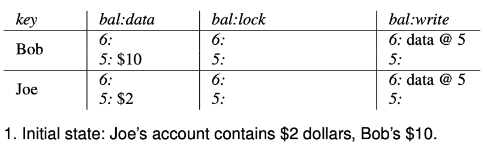
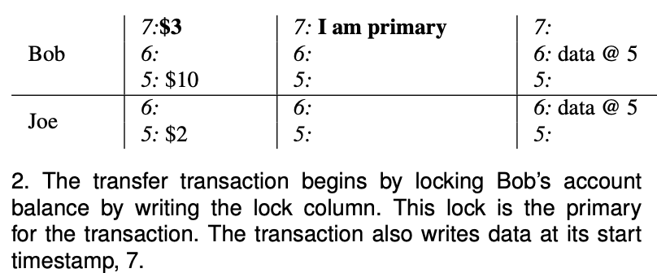
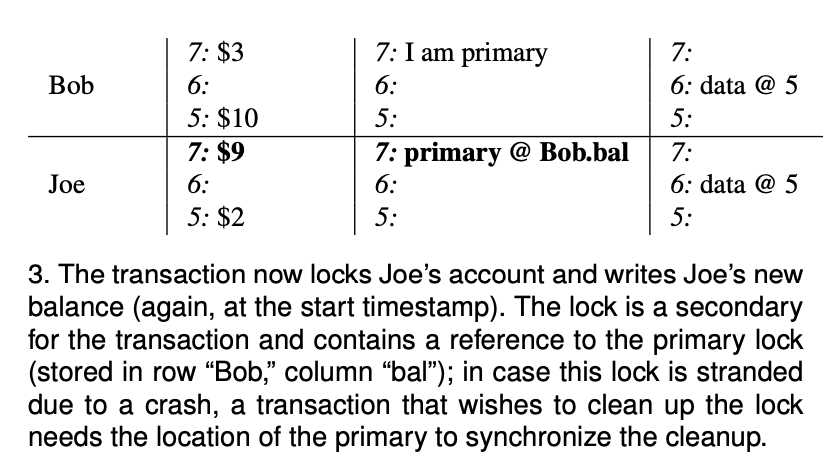
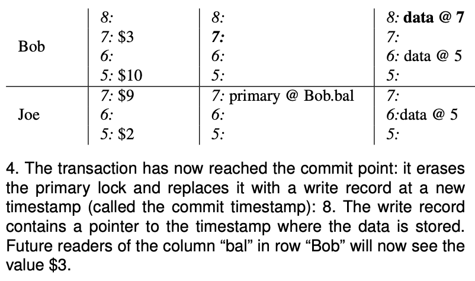
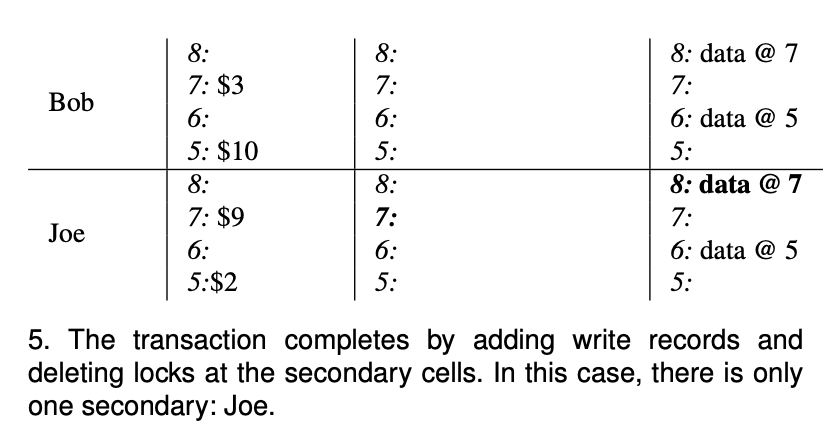

# 解决的问题

# 背景知识
## MVCC

## Snapshot isolation

# 可以利用的已有组件

# 两阶段提交算法
下面介绍一下如何利用两阶段提交算法实现转账功能：Blob给Joe转账$7

## 数据表示


数据表示:
- (key, column)定位一个数据cell
- 一个cell由个部分组成
  - data: 存储实际的数据，并且带有时间戳，而且可以存储多个版本
  - lock: 加锁（primary锁、secondary锁)
  - write: 存储指向实际数据的指针，并且带有时间戳，二期可以存储多个版本

读取timestamp=6&key=Blob&column=bla的数据：
- 读取timestamp=6&key=Blob的write字段：```data @ 5``` (说明实际数据的timestamp=5)
- 读取timestamp=5&key=Blob的data字段：```$10```
- 返回```$10```

## Step1: Buffer
事务提交前，在客户端 buffer 所有的 update/delete 操作。

## Step2: Pre-write
首先在所有行的写操作中选出一个作为 primary，其他的为 secondaries。

### Step2-1: Pre-write Primary

事务
- 首先对Bolb的账户加primary锁，
- 同时写入数据$3 ($10 - $7)，
- 时间戳 = 7

冲突
PrewritePrimary: 对 primaryRow 写入 L 列(上锁)，L 列中记录本次事务的开始时间戳。写入 L 列前会检查:

是否已经有别的客户端已经上锁 (Locking)。
是否在本次事务开始时间之后，检查 W 列，是否有更新 [startTs, +Inf) 的写操作已经提交 (Conflict)。
在这两种种情况下会返回事务冲突。否则，就成功上锁。将行的内容写入 row 中，时间戳设置为 startTs。


### Step2-2: Pre-write Secondary

然后
- 对Joe账户加secondary锁(包含执行primary锁的指针)，
- 同时写入数据$9 ($2 + $7)，
- 时间戳 = 7

## Step3: Commit

### Step3-1: Commit Primary

事务开始执行commit操作，
- 首先删除Blob账户的primary锁
- 同时在write字段写入```data @7```，表示实际数据的时间戳=7
- 时间戳 = 8

### Step3-2: Commit Secondary

异步？？？
事务最后执行secondary commit操作:
- 首先删除Joe的secondary锁
- 同时在write字段写入```data @7```，表示时间数据的时间戳=7
- 时间戳 = 8

# 参考
- [Large-scale Incremental Processing Using Distributed Transactions and Notifications](https://ai.google/research/pubs/pub36726)
- [Percolator 和 TiDB 事务算法](https://pingcap.com/blog-cn/percolator-and-txn/)
