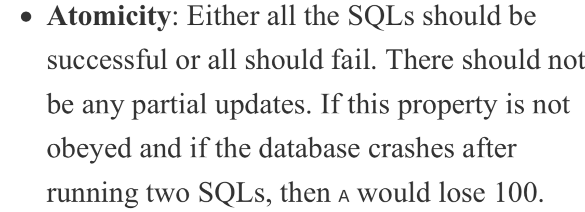
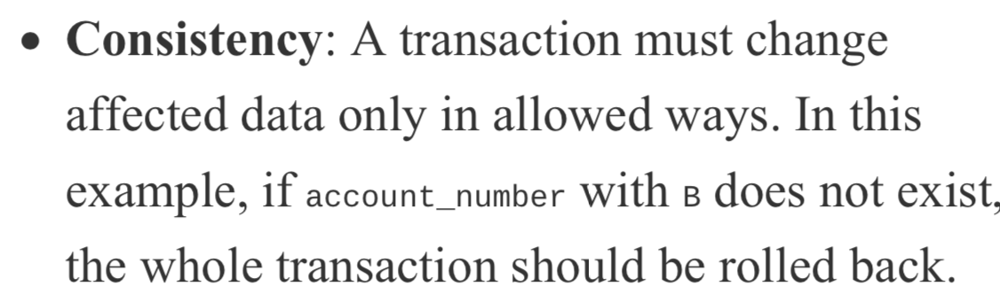
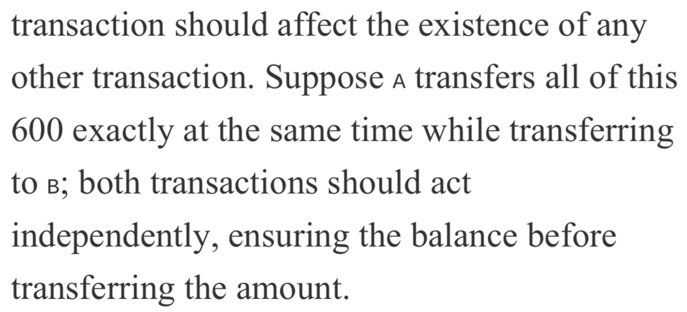
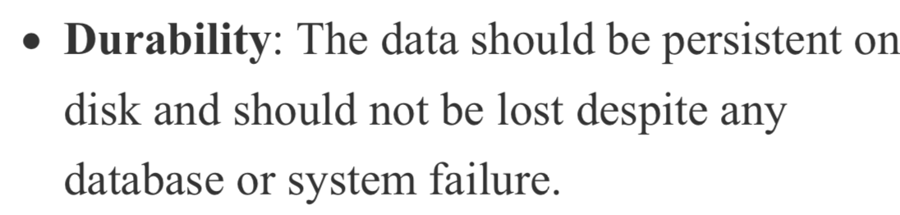
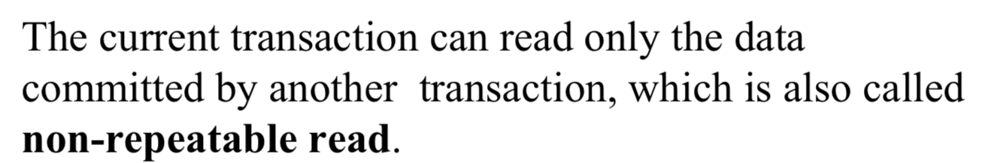
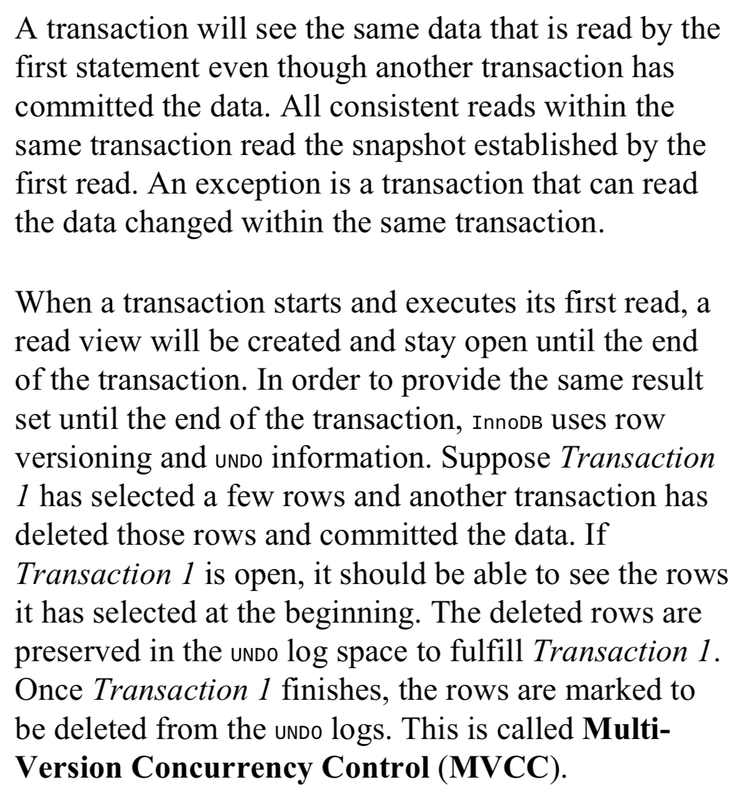
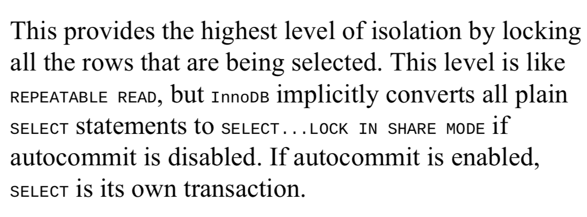

# Performing transactions
ACID
- Atomicity
- Consistency
- Isolation
- Durability










# Isolation levels
修改隔离级别
```
SET @@transaction_isolation = 'READ-COMMITTED';
```

mysql默认的事务隔离级别为Repeatable read

四种隔离级别
- Read uncommitted
- Read committed
- Repeatable read
- Serializable

## Read Uncommitted


- 加锁：不用锁
- 脏读：一个事务可以读取另一个尚未提交事务的修改数据

## Read Committed


- 加锁：写数据只会锁住相应的行
- 不可重复读：在同一个事务中，同一个查询在T1时间读取某一行，在T2时间重新读取这一行时候，这一行的数据已经发生修改，可能被更新了（update），也可能被删除了（delete）

## Repeatable Read


- 加锁：事务隔离级别为可重复读时，如果检索条件有索引（包括主键索引）的时候，默认加锁方式是next-key 锁；如果检索条件没有索引，更新数据时会锁住整张表。一个间隙被事务加了锁，其他事务是不能在这个间隙插入记录的，这样可以防止幻读。
- 幻像读：在同一事务中，同一查询多次进行时候，由于其他插入操作（insert）的事务提交，导致每次返回不同的结果集

## Serializable


事务隔离级别为串行化时，读写数据都会锁住整张表

## 补充
- 隔离级别越高，越能保证数据的完整性和一致性，但是对并发性能的影响也越大。
- MYSQL MVCC实现机制参考链接：https://blog.csdn.net/whoamiyang/article/details/51901888
- 关于next-key 锁可以参考链接：https://blog.csdn.net/bigtree_3721/article/details/73731377

# Locking
## Internal LocK
- Row-level lock
- Table-level lock

## External Lock
- Lock Table && Unlock Table
- Read || Write

# Performance Turning
## The explain plan
```
mysql > EXPLAIN SELECT * FROM ...
```

## Benchmarking queries and the server
```
shell> mysqlslap -u <user> -p<pass> --query="SELECT ..."
```

## Adding indexes
索引被使用的地方：
- WHERE
- ORDER BY
- GROUP BY
- JOIN

添加索引
```
mysql> ALTER TABLE employees ADD INDEX index_last_name(last_name);
```

## Invisible indexes
```
mysql> ALTER TABLE employees ALTER INDEX last_name INVISIBLE;
```

## Descending index
## Analyzing slow queries using pt-query-digest
## Optimizing datatypes
## Removing duplicate and redundant indexes
## Checking index usage
## Controlling the query optimizer
## Using index hints
## Indexing for JSON using generated columns
## Using resource groups
## Using performance schema
## Using the sys schema
