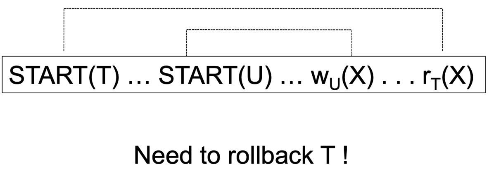
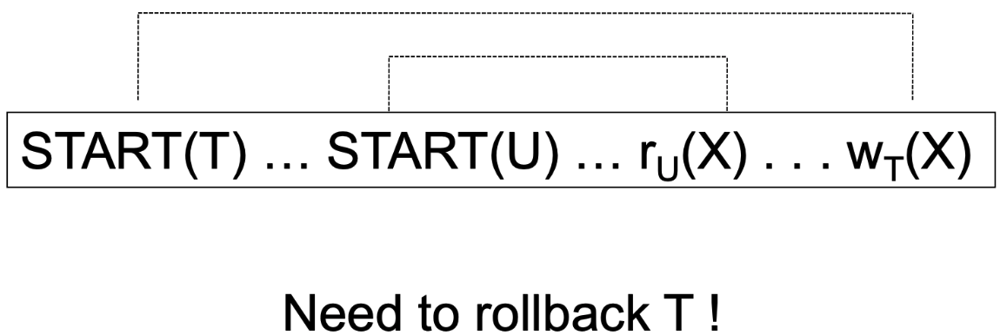
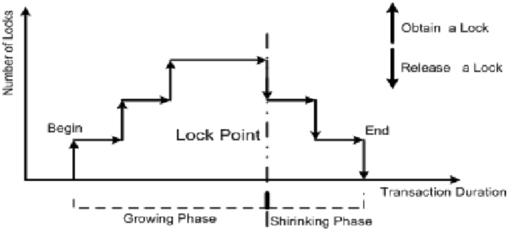
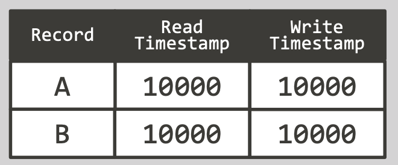
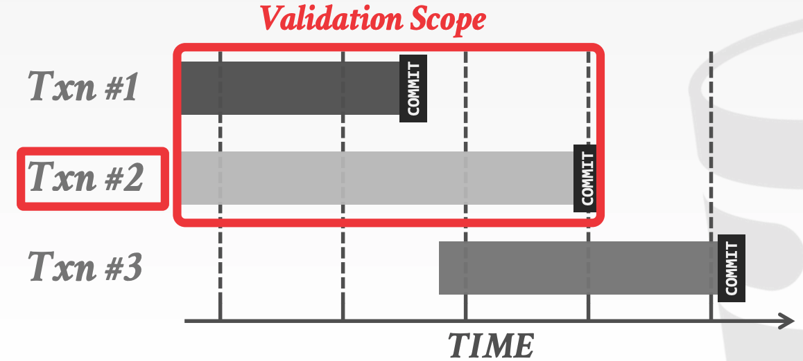
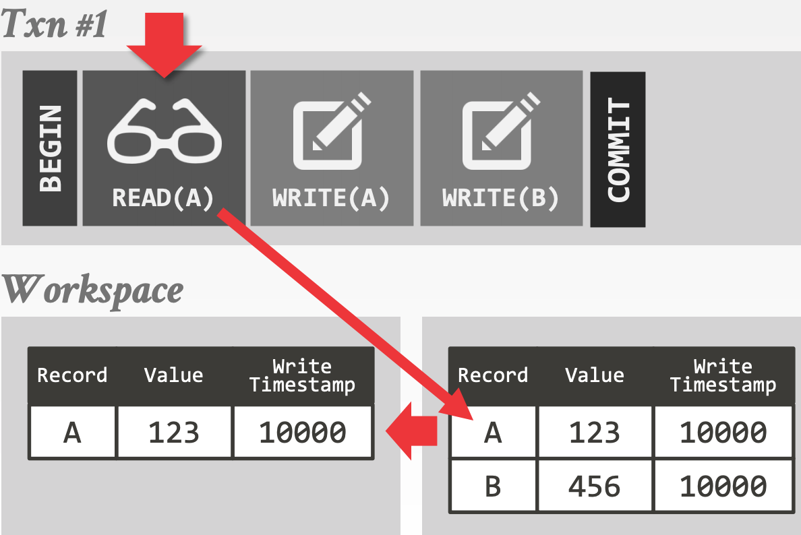
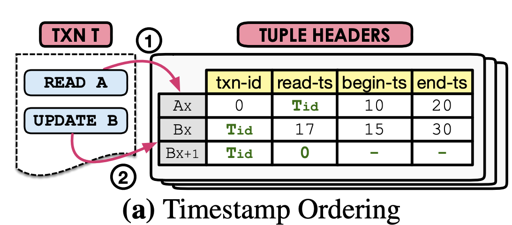
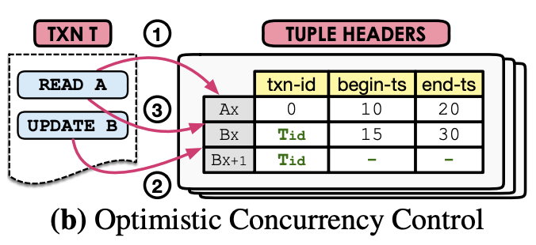
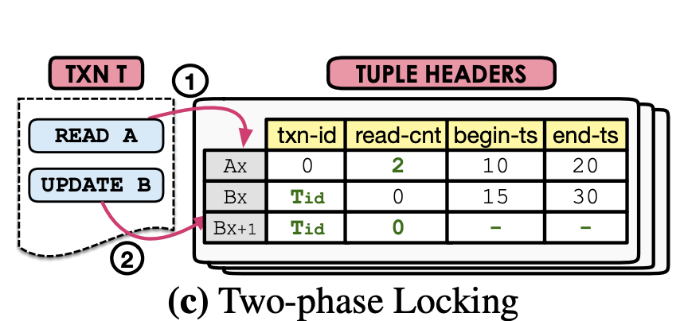
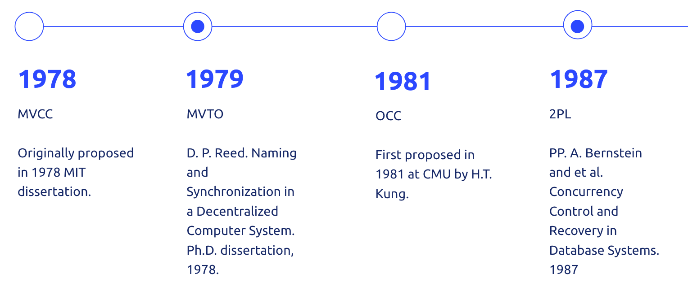

MVCC是目前大部分主流数据库实现并发控制的方法，本篇主要介绍一下数据库解决并发控制问题的发展历史，从最开始的`Two Phase Locking (2PL)`到`Basic Timestamp Ordering (Basic T/O)`，再到`Optimistic Concurrency Control(OCC)`。引入了`Multi Version`的概念后，又在原来的基础上产生了`Multi Version Two-phase Locking (MV2PL)`、`Multi Version Timestamp Ordering (MVTO)`和`Multi Version Optimistic Concurrency Control (MVOCC)`。

本篇涉及的都是单机版的数据库实现，后续会再讨论如果将MVCC和分布式数据库结合。

# 事务冲突类型
两个事务并发，什么情况下会冲突?

需要满足以下条件:
- 操作同一对象：两个事务都尝试修改A账户的余额，这就有冲突，如果修改的是不同的账户，就没有冲突
- 发生在不同事务：单个事务内无论对A账户的余额做了多少次修改，都不会产生冲突
- 读写/写读/写写：无论多少个事务，如果对A账户的余额只有读操作，那就永远没有冲突

## 读写冲突(read too late)


T想读X，U想写X，并且T开始早于U，理论上T应该读取修改前的X，但是按照上图的顺序，T会读取修改后的X，这是就发生了读写冲突，T应该回滚。

## 写读冲突(write too late)


T想写X，U想读X，并且T开始早于U，理论上U应该读取修改后的X，但是按照上图的顺序，U读取了修改前的X，这就发生了写读冲突，T应该回滚。

## 脏读(dirty read)


U想写X，T想读X，并且U开始早于T，U写完后发生了回滚操作，理论上T应该读到修改前的X，但是按照上图的顺序，T读取了修改后的X，这就发生了脏读，T应该要等到U commit后才能进行读操作。

## 写写覆盖
```
START(T) ... START(U) ... wU(X) ... wT(X)
```
T和U都想写X，并且T开始早于U，理论上应该是U的写操作会覆盖T的写操作，但是按照上图的顺序，T覆盖了U，这就发生了写写覆盖冲突，T应该要回滚。

# 并发控制 Concurrency Control
Concurrency Control就是为了来解决并发事务之间的冲突。

> A DBMS’ concurrency control protocol to allow transactions to access a database in a multi-programmed fashion while preserving the illusion that each of them is executing alone on a dedicated system. The goal is to have the effect of a group of transactions on the database’s state is equivalent to any serial execution of all transactions.

DBMS并发控制协议可以使得不同的事务可以并发的访问DBMS，同时让不同的事务感觉仿佛只有自己一个事务在运行。也就是说并发控制需要达到这样的目标：不同事务并发的执行结果，和这些事务串行的执行的结果是等价的。

实现并发控制有两种办法：
> 1. Two-Phase Locking (Pessimistic): Assume transactions will conflict so they must acquire locks on database objects before they are allowed to access them.
> 2. Timestamp Ordering (Optimistic): Assume that conflicts are rare so transactions do not need to first acquire locks on database objects and instead check for conflicts at commit time.

Two-Phase Locking是一种悲观锁模式，假设事务冲突比较严重，因此在访问数据前需要先获得锁。

Timestamp Ordering是一种乐观锁模式，假设事务冲突比较少，因此在访问数据前不需要获得锁，而是在commit的时候检查冲突。

## Two-Phase Locking (2PL)
2PL是指事务的执行可以分为两个阶段：生长阶段Growing Phase（加锁阶段）和衰退阶段Shrinking Phase（解锁阶段）：
- 加锁阶段：在该阶段可以进行加锁操作。在对任何数据进行读操作之前要申请并获得读锁，在进行写操作之前要申请并获得写锁。加锁不成功，则事务进入等待状态，直到加锁成功才继续执行。
- 解锁阶段：当事务释放了一个封锁以后，事务进入解锁阶段，在该阶段只能进行解锁操作不能再进行加锁操作。



可以证明，若并发执行的所有事务均遵守两段锁协议，则对这些事务的任何并发调度策略都是可串行化的。

需要注意的是2PL可能会有死锁问题，需要有死锁检测和防范机制。

因为2PL对所有读写的数据都进行了加锁，因此不同事物之间的读写冲突都可以避免，也正是由于对所有读写的数据都进行了加锁，并发访问冲突比较多的时候，由于锁竞争，会导致事物执行效率大大降低。

## Basic Timestamp Ordering Protocol
Basic T/O使用Timestamp来决定事务的先后顺序。

> Basic T/O Protocol
- Every transaction is assigned a unique timestamp when they arrive in the system.
- The DBMS maintains separate timestamps in each tuple’s header of the last transaction that read that tuple or wrote to it.
- Each transaction check for conflicts on each read/write by comparing their timestamp with the timestamp of the tuple they are accessing.
- The DBMS needs copy a tuple into the transaction’s private workspace when reading a tuple to ensure repeatable reads

Basic T/O协议主要特点：
- 每个事务都会被赋予一个Timestamp
- 每条数据都会记录最近读取该数据的事务id，以及最近写入的事务id
- 每个事务在读写数据时需要根据事务的timestamp和数据的读写timestamp进行冲突检测
- DBMS会把事务读取过的数据拷贝到一个private的空间，来实现可重复读

Basic T/O需要对每条记录额外存储以下几个信息：
1. Read Timestamp: 表示读过该数据中最大的事务Timestamp
2. Write Timestamp: 最近更新该数据的事务Timestamp



read流程：
```
If TS < W-ts(x) then
  reject read request and abort corresponding transaction
else
  execute transaction
  Set R-ts(x) to max{R-ts(x), TS}
```

write流程：
```
If TS < R-ts(x) or TS < W-ts(x) then
  reject write request
else
  execute transaction
  Set W-ts(x) to TS.
```

Basic T/O如何解决读写冲突：
- 读写冲突：读取的时候会发现`TS < W-ts(x)`，读取事务失败回滚
- 写读冲突：写入的时候会发现`TS < R-ts(x)`，写入事务失败回滚
- 脏读：没法解决
- 写写覆盖：后写入的事务会发现`TS < w-ts(x)`，后写入的事务失败回滚

可以发现Basic T/O可以成功解决读写、写读和写写覆盖这些并发冲突问题，但是由于commit前数据的修改是直接在DBMS记录上做的修改，因此无法解决事务回滚导致的冲突，例如脏读问题。

## Optimistic Concurrency Control (OCC)
OCC会把所有修改先缓存到本地private空间，然后在commit的时候检测冲突并merge，因此可以成功解决Basic T/O无法处理事务回滚引起冲突的问题。

> Three Phases:
- Read Phase: Transaction’s copy tuples accessed to private work space to ensure repeatable reads，and keep track of read/write sets.
- Validation Phase: When the transaction invokes COMMIT，the DBMS checks if it conflicts with other transactions. Parallel validation means that each transaction must check the read/write set of other transactions that are trying to validate at the same time. Each transaction has to acquire locks for its write set records in some global order. Original OCC uses serial validation.
  - Backward Validation: Check whether the committing transaction intersects its read/write sets with those of any transactions that have already committed.
  - Forward Validation: Check whether the committing transaction intersects its read/write sets with any active transactions that have not yet committed.
- Write Phase: The DBMS propagates the changes in the transactions write set to the database and makes them visible to other transactions’ items. As each record is updated，the transaction releases the lock acquired during the Validation Phase

OCC事务提交分三个阶段：
- 读取阶段：所有读取的数据会拷贝到本地空间，所有写也只记录到本地空间
- 验证阶段：事务执行commit的时候，DBMS会先检查该事务是否和其他事务有冲突，验证阶段需要对事务修改的数据进行加锁
- 写阶段：把本地空间的修改apply到DBMS，让其他事务可见，最后释放验证阶段加的锁

先介绍一下Validation：

当事务commit的时候，DBMS会该事务和其他事务是否冲突，有两种检测方法：
1. Backward Validation
2. Forward Validation

Backword Validation会检查当前事务读写的数据集是否和已提交的事务冲突。

> Check whether the committing txn intersects its read/write sets with those of any txns that have already committed.



OCC需要对每条记录额外存储以下几个信息：
1. Write Timestamp: 最近更新该数据的事务的Timestamp



read流程：
```
If private workspace does not contain(x)
  copy x from DBMS to private workspace
return x from private workspace
```

write流程：
```
If private workspace does not contain(x)
  copy x from DBMS to private workspace
update x in private workspace
```

commit流程：
```
TS = generate next timestamp
if(validate success)
  execute transaction
  apply modification from private workspace to DBMS
else
  reject and abort
```

回滚流程：
```
clear private workspace
```

OCC如何解决读写冲突：
- 读写冲突：写入的数据没有commit前还在private workspace，所以读取的还是写入前的数据，所以没有冲突
- 写读冲突：读的事务在validation阶段会发现自己读的数据被最近commit的事务修改过，读事务会回滚
- 脏读：未commit的数据不会被其他事务读到，因此不会发生脏读
- 写写覆盖：事务的顺序是按照commit的顺序决定的，先开始的事务先commit，后开始的事务后commit，因此不会发生先开始的事务覆盖后开始的事务数据的问题

OCC成功解决了所有读写冲突的问题，但是每次读取数据都需要把数据拷贝到private空间，导致读取效率比较低。

# MVCC
MVCC使用`Multi Version`的方法，即对一个`logical tuple`存储多个版本的`physical tuple`，可以解决OCC读取时需要把数据拷贝到private空间的问题。

> MVCC is currently the best approach for supporting transactions in mixed workloads. The DBMS maintains multiple physical versions of an object of a single logical object in the database. When a transaction writes to an object, the DBMS, creates a new version of that object. When a transaction reads an object, it reads the newest version that existed when a transaction started.

MVCC目前已经被广泛使用到DBMS中，DBMS保持一个逻辑数据的多个物理版本，当事务写入时创建一个新的物理版本，当事务读取时，返回最新的物理版本。

MVCC主要的优点：
- Writes do not block readers （写不会阻塞读）
- Read-only transactions can read a consistent snapshot without acquiring locks （只读的事务不需要加锁，就可以获得一致性的快照）
- Easily support time-travel queries （天然支持time-travel)

`Multi Version`不仅仅可以和OCC结合，也可以和2PC、Basic T/O结合，因此产生了：
1. Multi Version Timestamp Ordering (MVTO)
2. Multi Version Optimistic Concurrency Control (MVOCC)
3. Multi Version Two-phase Locking (MV2PL)

## Multi Version Timestamp Ordering (MVTO)
MVTO是在Basic T/O的基础上加上Mulit Version的功能。

MVTO需要对每条记录额外存储以下几个信息：
1. txn-id: 0表示没有被锁，非0表示该锁被ID=txn-id的事务锁持有
2. read-ts: 读取该条记录的事务中txn-id的最大值
3. begin-ts：写入该条记录的事务txn-id
4. end-ts：如果该条记录是最新的，则end-ts=INF；否则ent-ts=下一个版本的begin-ts

MVTO的特点：
- Use the transactions’ identifiers (Tid) to precompute their serialization order (使用事务ID预先计算串行顺序)
- Use a read-ts field in the header to keep track of the timestamp of the last transaction that read it （使用read-ts记录最近读取该条数据的事务）
- Transaction is allowed to read version if the lock is unset and its Tid is between begin-ts and end-ts （事务允许读的条件：记录没有被加锁  && 事务id介于begin-ts和end-ts之间）
- For writes, transaction creates a new version if no other transaction holds lock and Tid is greater than read-ts （事务允许写的条件：记录没有被加锁 && 事务id大于read-ts）



事务start流程：
```
Tid = genreate next timestamp
```

read流程：
```
if (find Ax satisfy begin-ts(Ax) <= Tid < end-ts(Ax))
  if (txn-id(Ax) == 0)
    execute transaction
    set read-ts(Ax) to max{read-ts(Ax), Tid}
  else
    reject read request and abort corresponding transaction
else
  return A does not exist
```

write流程：
```
if (find Bx satisfy end-ts(Bx) == INF)
  if (txn-id(Bx) == 0 and Tid > read-ts(Bx))
    execute transaction
    txn-id(Bx) = Tid
    new Bx+1
    txn-id(Bx+1) = Tid
    read-ts(Bx+1) = 0
    set read-ts(Ax) to max{read-ts(Ax), Tid}
    add Bx+1 to WriteSet
  else
    reject write request and abort corresponding transaction
else
  return B does not exist
```

commit流程
```
for Ix+1 in WriteSet
  begin-ts(Ix+1) = Tid
  end-ts(Ix+1) = INF
  end-ts(Ix) = Tid
  txn-id(Ix) = 0
  txn-id(Ix+1) = 0
```

MVTO如何解决读写冲突：
- 读写冲突：写会创建一个新的数据版本，因为读的timestamp < 写的timestamp，所以会读到写之前的数据，因此不会发生冲突
- 写读冲突：读会更新read-ts，写的事务会发现自己的timestamp < read-ts，因此会写失败
- 脏读：通过创建新的版本来实现写，因此一个事务写回滚，不会影响另外一个事务读
- 写写覆盖：写写通过加锁进行互斥访问，先获得锁的事务写入成功

##  Multi Version Optimistic Concurrency Control (MVOCC)
MVOCC是在OCC的基础上加上Mulit Version的功能。

MVOCC需要对每条记录额外存储以下几个信息：
1. txn-id: 0表示当前没有加锁，非0表示当前被txn-id这个事务加了锁
2. begin-ts：写入该条记录的事务的commit timestamp
3. end-ts：如果该条记录是最新的，则end-ts=INF；否则ent-ts=下一个版本的begin-ts

MVOCC事务提交分三个阶段：
- read phase：
  - 读：根据数据的`begin-ts`和`end-ts`，返回该数据最新的已commit的版本
  - 写：获取写锁，创建新版本
- validation phase：
  - 获取`事务commit timestamp`，决定了事务的serialization order
  - 检查read set中的数据是否被已commit的事务所修改，如果冲突则回滚
- write phase：把所有修改的数据的`begin-ts`设置为`事务commit timestamp`，`end-ts`设置为`INF`

一个事务修改的数据只有commit后，才能被另外一个事务看到。如果一个事务读取了过时的数据，在该事务提交后执行验证阶段会检测出来，如果冲突则回滚。



事务start流程：
```
Tstart = generate next timestamp
```

read流程：
```
find Ax satisfy begin-ts(Ax) <= Tstart < end-ts(Ax)
if txn-id(Ax) == 0
  execute transaction
  add Ax to Read Set
  return Ax
else
  wait and retry or abort
```

write流程：
```
find Bx satisfy end-ts(Bx) == INF
if txn-id(Bx) == 0
  set txn-id(Bx) = Tstart
  create Bx+1
  set txn-id(Bx+1) = Tstart
  add Bx to Write Set
else
  wait and retry or abort
```

commit流程：
```
Tcommit = generate next timestamp
for all Rx in Read Set
  if Rx is updated in committed transaction
    abort transaction
for all Wx in Write Set
  set begin-ts(Wx+1) = Tcommit
  set end-ts(Wx+1) = INF
  set end-ts(Wx) = Tcommit
  set txn-id(Wx) = 0
  set txt-id(Wx+1) = 0
```

abort流程：
```
for all Wx in Write Set
  delete Wx+1
  set txn-id(Wx) = 0
```

MVOCC如何解决读写冲突：
- 读写冲突：因为有多版本，所以后面的写不会影响前面的读，不会冲突
- 写读冲突： 虽然读取了老的数据，但是会在validataion的时候发现有事务已经更新了数据，因此读会回滚
- 脏读：只会读取commit的数据，因此不会出现脏读
- 写写覆盖：写写通过加锁进行互斥访问，先获得锁的事务写入成功

## Multi Version Two-phase Locking (MV2PL)
MVOCC是在2PC的基础上加上Mulit Version的功能。

MV2PL需要对每条记录额外存储以下几个信息：
1. txn-id: 当前对该记录加写锁的txn-id，0表示没有写锁
2. read-cnt: 表示读锁的数量，0表示没有读锁
3. begin-ts:写入该条记录的事务txn-id
4. end-ts：如果该条记录是最新的，则end-ts=INF；否则ent-ts=下一个版本的begin-ts



事务start流程：
```
Tstart = generate next timestamp
```

read流程：
```
find Ax satisfy begin-ts(Ax) <= Tstart < end-ts(Ax)
if txn-id(Ax) == 0
  read-cnt(Ax) += 1
  execute transaction
  return Ax
else
  wait and retry or abort
```

write流程：
```
find Bx satisfy end-ts(Bx) == INF
if txn-id(Bx) == 0 && read-cnt(Bx) == 0
  set txn-id(Bx) = Tstart
  create Bx+1
  set txn-id(Bx+1) = Tstart
  add Bx to Write Set
else
  wait and retry or abort
```

commit流程：
```
Tcommit = generate next timestamp
for all Wx in Write Set
  set begin-ts(Wx+1) = Tcommit
  set end-ts(Wx+1) = INF
  set end-ts(Wx) = Tcommit
  set txn-id(Wx) = 0
  set txt-id(Wx+1) = 0
for all Rx in Read Set
  set read-cnt(Rx) -= 1
```

abort流程：
```
for all Wx in Write Set
  delete Wx+1
  set txn-id(Wx) = 0
for all Rx in Read Set
  set read-cnt(Rx) -= 1
```

MVTO如何解决读写冲突：
- 读写冲突：读写谁先加到锁，谁成功
- 写读冲突：读写谁先加到锁，谁成功
- 脏读：读取的都是commit的数据，不会发生脏读
- 写写覆盖：写锁互斥方式

# MVCC Overview

| 算法      | 序列化时间戳 | 读写冲突     | 写读冲突     | 脏读     | 写写覆盖         |
| --------- | ------------ | ------------ | ------------ | -------- | ---------------- |
| 2PL       | start-ts     | ok           | ok           | ok       | ok               |
| Basic T/O | start-ts     | 写成功读失败 | 读成功写失败 | 有冲突   | 先写成功后写失败 |
| OCC       | commit-ts    | 没有冲突     | 写成功读失败 | 没有冲突 | 没有冲突         |
| MV-TO     | start-ts     | 没有冲突     | 读成功写失败 | 没有冲突 | 先写成功后写失败 |
| MV-OCC    | commit-ts    | 没有冲突     | 写成功读失败 | 没有冲突 | 先写成功后写失败 |
| MV-2PL    | commit-ts    | 抢到锁的成功 | 抢到锁的成功 | 没有冲突 | 抢到锁的成功     |

# Timeline of MVCC


# 常见DBMS使用的并发控制协议

| 数据库   | 并发控制协议 |
| -------- | ------------ |
| Oracle   | MV2PL        |
| Postgres | MV-2PL/MV-TO |
| HYRISE   | MV-OCC       |
| Hekaton  | MV-OCC       |
| MemSQL   | MV-OCC       |
| SAP HANA | MV-2PL       |
| NuoDB    | MV-2PL       |
| HyPer    | MV-OCC       |

# 参考
- [CMU 15-721 DBMS课程](https://15721.courses.cs.cmu.edu/spring2018/schedule.html)
- [An Empirical Evaluation of In-Memory Multi-Version Concurrency Control](https://15721.courses.cs.cmu.edu/spring2018/papers/05-mvcc1/wu-vldb2017.pdf)
- [Basic T/O，MV-TO以及"真"MVCC -- 吉姆餐厅](https://zhuanlan.zhihu.com/p/30635236)
- [数据库中的two phase locking](https://www.cnblogs.com/lyhabc/p/4753540.html)
