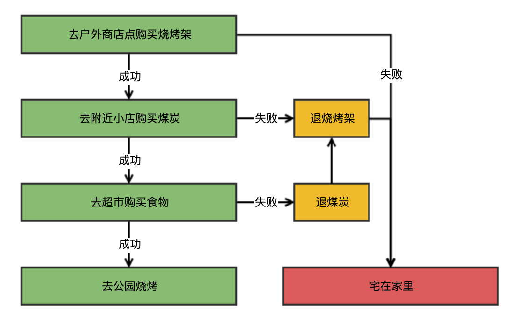
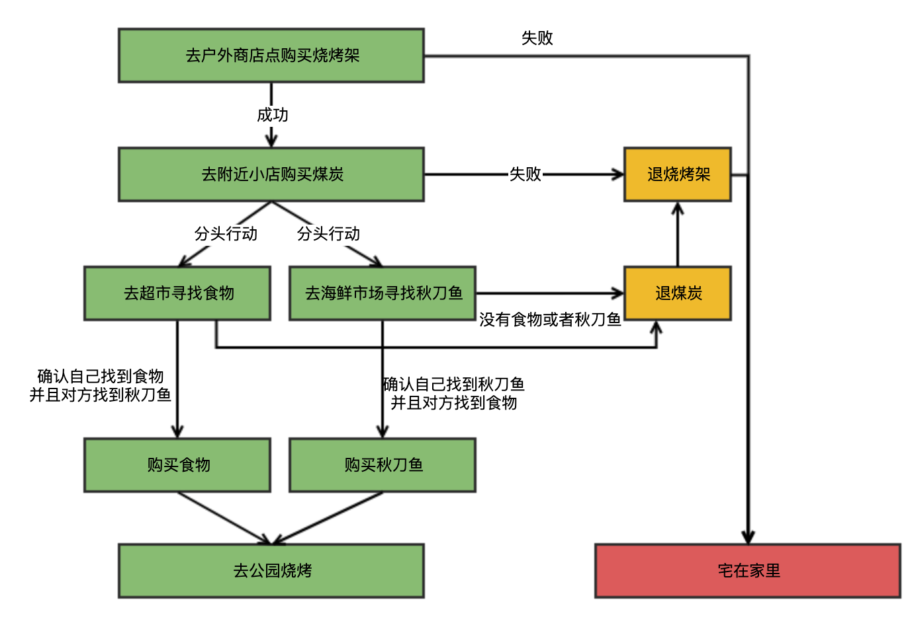
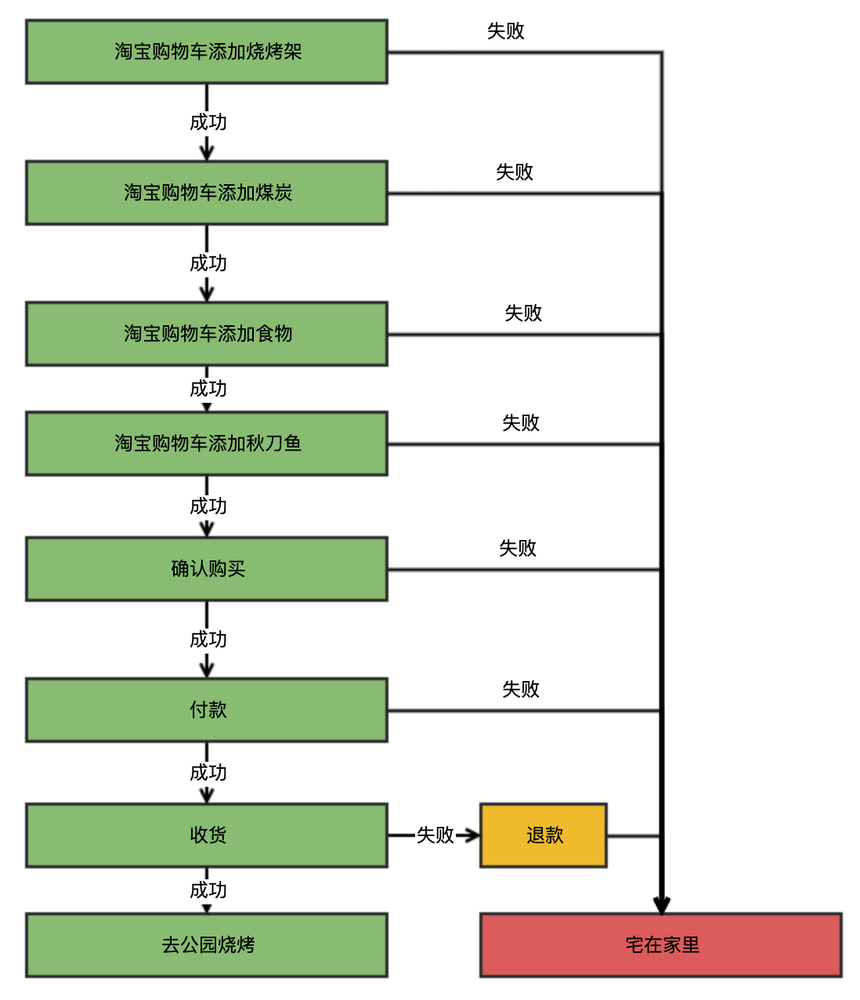

周末天气很好，我们打算去公园烧烤，需要提前购买：
1. 食物
2. 烧烤架
3. 煤炭

# 方案一
食物需要去超市购买，且不能退货；烧烤架需要去户外商品店购买，支持七天无理由退货；煤炭需要去附件的小店购买，支持七天无理由退货。食物、烧烤架、煤炭都有可能缺货，而我们需要全部买齐才能去公园烧烤，否则只能宅在家里。

这是一个不需要使用两阶段提交的场景，一个正确的购买流程如下：

# 方案二
本来方案已经设计的挺好了，但是老婆突然说想吃烤秋刀鱼，而秋刀鱼只能去海鲜市场购买，而不支持退货。原先的方案就行不通了，因为不管先去超市买食物还是先去海鲜市场买秋刀鱼，买了其中一个万一另外一个没有了，就没办法退货了。

没关系我们还有两阶段提交算法，流程如下：

在购买食物和秋刀鱼之前，需要两个人同时去超市和海鲜市场确认有没有（prepare阶段）。如果其中一个没有或者两个都没有，就放弃购买；只有在两边同时有的情况下，才一起购买（commit阶段）。这样才能保证要么都不买，要么都购买。

# 方案三
由于本人比较懒，不想跑这么多地方，而且万一去超时购买食物失败，还需要再回去退煤炭和退烧烤架，有没有一种办法能一下子买齐（或者如果其中一个缺货，直接告诉我凑不齐）？

答案显而易见就是淘宝，流程如下：

根本的原因是淘宝的`确认购买`操作具有`原子性`:
- 如果购物车里面某个商品缺货，会导致`确认购买`失败
- 只有当购物车里面的商品都有货的时候，才会`确认购买`成功
- 一旦`确认购买`成功，你肯定能买到所有购物车里面的商品

# 下面的可以不看
对应到技术领域，
- 方案一：业务逻辑自己实现原子性，一旦某个操作失败，需要写代码回滚之前成功的操作
- 方案二：业务逻辑使用两阶段提交算法保证原子性
- 方案三：使用支持事务的数据库
