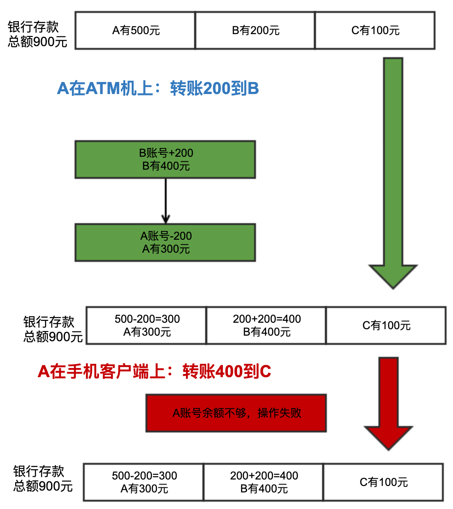
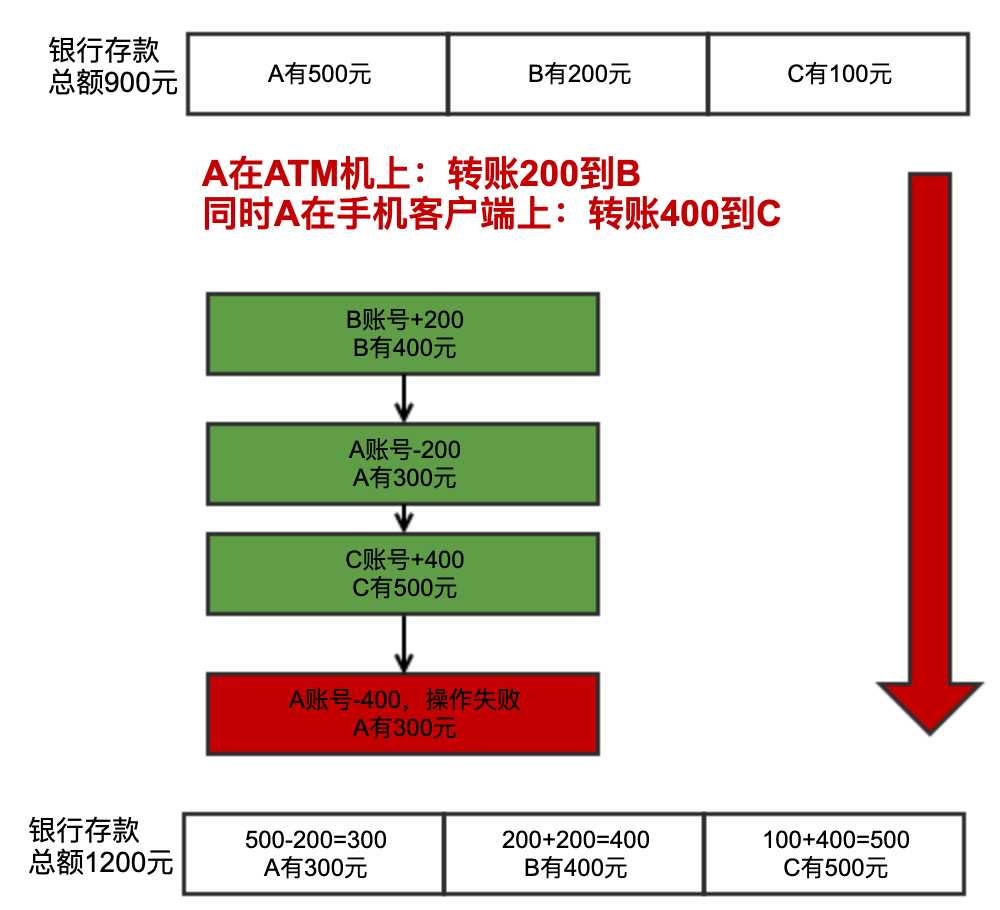
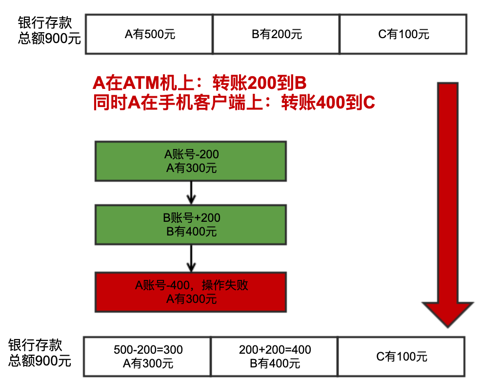
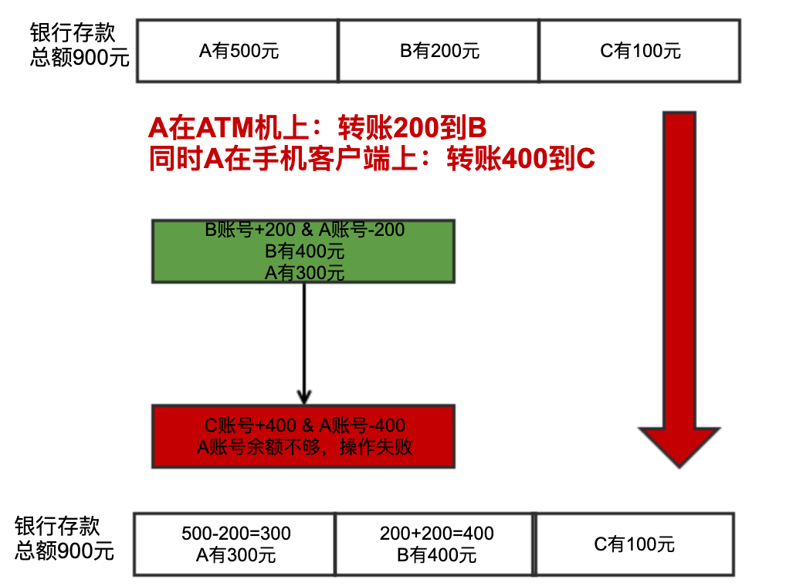

数据库事务Transaction有四大特点：ACID
- Atomicity 原子性
- Consistency 一致性
- Isolation 隔离性
- Durability 持久性

本文主要介绍一下Atomicity原子性。

# 串行场景
假设A、B和C在银行都有存款，存款额分别为：
- A有500元
- B有200元
- C有100元

现在A在ATM机上给B转账200元，然后又在手机客户端上给C转账400元，
1. 给B可以成功转账，余额分别为A=300 B=400 C=100
2. 给C转账会失败，因为A的余额少于转账金额




# 并行场景
刚在是串行执行的场景，没有任何问题，转账B成功，转账A失败，总金额不变（都是900元）。

但是如果两个转账操作是同时进行，由于A的初始金额是500,给C转账的时候不会发现余额不足，一个可能的执行逻辑如下：
1. 给B可以成功转账，余额分别为A=300 B=400 C=100
2. 给A转账成功一半，C增加400,A减400失败


这时候发现银行总存款从900元变成1200元，数据发生了不一致的情况。

# 一种办法
有人会想到一个办法，转账的时候先做减法，再做加法，这样减法就会失败，就不会执行加法，这样银行总存款就是正确的。


这确实可以解决这个问题，但是如果考虑到可能会由于其他原因（网络、磁盘故障），在减法成功的前提下，最后一步加法失败，还是会导致总存款不一致。


# 另外一种办法
也许有人想到了另外一种办法，就是如果发现最后A-400失败，可以恢复上一步操作，即让C-400，这样还是可以保证总存款是正确的。

这确实也是一个办法，但是同样如果考虑到可能会由于其他原因（网络、磁盘故障）导致最后恢复上一步操作的时候失败，还是会导致总存款不一致。

# 原子性
最后发现无论我们怎么设计流程，都无法100%保证数据正确性，根本的原因是：
1. 我们需要做两个操作（对一个数做加法，对另外一个数做减法）
2. 任何一个操作都有可能成功或者失败
3. 我们需要保证数据一致性的前提是：要么两个操作都成功，要么两个操作都失败

这时候就需要用到事务的原子性。

```
原子性是指事务是一个不可再分割的工作单位，事务中的操作要么都发生，要么都不发生。
```

也就是说我们需要把`B账号+200 & A账号-200`放到一个事务中执行，要么全部成功，要么全部失败，如下图所示：
1. `B账号+200 & A账号-200`成功
2. `C账号+400 & A账号-400`失败


最后银行存款总额保持900元，数据保证了正确性。
