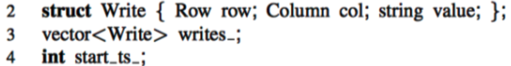
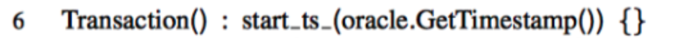

本文将介绍一下谷歌在2010发表的论文《Large-scale Incremental Processing Using Distributed Transactions and Notifications》。

# Percolator 简介
Percolator是由Google公司开发的、为大数据集群进行增量处理更新的系统，主要用于google网页搜索索引服务。使用基于Percolator的增量处理系统代替原有的批处理索引系统后，Google在处理同样数据量的文档时，将文档的平均搜索延时降低了50%。

Percolator是在Bigtable之上实现的，是为Bigtable定制的，它以Client library的方式实现。Percolator利用Bigtable的单行事务能力，仅仅依靠客户端侧的协议和一个全局的授时服务器TSO就实现了跨机器的多行事务。

# 存储结构
用户指定的Perocolator中的Column在Bigtable中会映射到如下3个Column：
- lock: 存储锁信息
- write: 存储commit的timestame以及标记该行已经committed
- data: 存储实际数据

实际的数据由这三列共同决定，下面看一个例子：

如何查看Bob账户有多少钱？

先查询`column write`获取最新时间戳的数据，获取到`data@5`，然后查询`column data`里面时间戳为`5`的数据，即`$10`，也就是说Bob账户目前有10美元。

# 事务读写流程
一个事务的所有Write在提交之前都会先缓存在Client，然后在提交阶段一次性写入；Percolator 的事务提交是标准的两阶段提交，分为Prewrite和Commit。在每个Transaction开启时会从TSO获取timestamp作为start_ts，在Prewrite成功后Commit前从TSO获取timestamp作为 commit_ts。协议伪代码如下图：

## 数据结构
先来看一下数据结构`struct Write`包含
1. `Row row` 表示某一行
2. `Column col` 表示某一列
3. `string value` 表示实际写入的数据

另外
1. `vector<Write> writes_` 用于在内存中缓存需要写入的数据
2. `int start_ts_`表示事务开始的`timestamp`

## 初始化
初始化`Transaction`的时候获取了一下`start_ts_`

## Set
`Set`只是简单的在内存中做个缓存，实际写入会在`Commit`时触发

## Get
Get操作
1. 先看一下是否有`timestamp`小于`start_ts`的锁，如果有的话需要先`Cleanup lock`
2. 然后读取并返回`commit timestamp`小于`start_ts`的最新的数据

## Cleanup lock
Cleanup primary lock: 看该主锁是否已超时，如果超时直接把锁删除，否则不做任何操作

Cleanup secondary lock: 先看主锁的状态
1. 主锁已经commit: commit该次锁
2. 主锁未commit && 已超时: 如果次锁也超时则清理次锁，否则不做任何操作
3. 主锁未commit && 未超时: 不做任何操作

## Prewrite
prewrite阶段
1. 先看一下有没有`commit timestamp`大于`start_ts`的数据，如果已经有了说明已经有后续的事务提交了数据，这是本事务不能再往里面写了，直接return false
2. 再看一下是否已经被上锁了，如果有的话说明有写冲突，直接return false
3. 写入`data`和`lock`字段

## Commit
commit阶段
1. 先从需要写入的数据中任选一行作为`primary`，其他的作为`secondary`
2. 接着调用`prewrite primary`
3. 然后对`secondary rows`进行循环调用`prewrite secondary`
4. 获取`commit_ts`
5. 查询`primary row`上是否有锁，如果没有说明被已经超时被清理，直接退出
6. 对`primary row`写入`write`列同时清除`lock`列
7. 至此数据已写入成功
8. 对`secondary rows`循环，写入`write`列同时清除`lock`列

# 案例
下面来看一个银行转账的案例，Bob向Joe转账7美元。

## 初始状态
初始状态下Bob有10美元，Joe有2美元。

## Prewrite Primary
开始prewrte阶段，首先
1. 获取下一个时间戳`timestamp=7`作为事务的`start_ts`
2. 将Bob作为事务的`primary row`
3. `lock`列写入`Primary Lock`
4. 同时`data`列写入`3`

## Prewrite Secondary
同样使用上一步获取的`start_ts=7`
1. 将Joe的数据`9`写入到`data`列
2. 同时将`lock`列指向上一步的`Primary Lock`

## Commit Primary
开始commit阶段，
1. 获取`commit_ts=8`
2. 删除primary所在的`lock`列的锁
3. 并将`write`列写入提交时间戳指向的数据存储`data@7`

## Commit Secondary
依次遍历`secondary rows`
1. `write`column中写入数据时间戳
2. 同时删除`lock`列的锁

# 总结
Percolator基于Bigtable的单行事务提供了多行事务的能力，核心思想包括：
1. 将事务提交是否成功落实到一个原子操作，即`primary row`是否`commit`成功
2. 写入失败遗漏的锁，通过后续读阶段进行超时清理
3. 通过全局唯一递增的时间戳，判断写冲突，并提供Snapshot Isolation级别的隔离

# 参考
- [Large-scale Incremental Processing Using Distributed Transactions and Notifications](https://storage.googleapis.com/pub-tools-public-publication-data/pdf/36726.pdf)
- [Percolator 和 TiDB 事务算法](https://pingcap.com/blog-cn/percolator-and-txn/)
- [Google Percolator 的事务模型](http://andremouche.github.io/transaction/percolator.html)
- [Transaction in TiDB](http://andremouche.github.io/tidb/transaction_in_tidb.html)
- [Google Percolator 分布式事务实现原理解读](http://mysql.taobao.org/monthly/2018/11/02/)
