本文将介绍一下谷歌在2010发表的论文《Large-scale Incremental Processing Using Distributed Transactions and Notifications》。

# Percolator 简介
Percolator是由Google公司开发的、为大数据集群进行增量处理更新的系统，主要用于google网页搜索索引服务。使用基于Percolator的增量处理系统代替原有的批处理索引系统后，Google在处理同样数据量的文档时，将文档的平均搜索延时降低了50%。

Percolator是在Bigtable之上实现的，是为Bigtable定制的，它以Client library的方式实现。Percolator利用Bigtable的单行事务能力，仅仅依靠客户端侧的协议和一个全局的授时服务器TSO就实现了跨机器的多行事务。

# 存储结构
用户指定的Perocolator中的Column在Bigtable中会映射到如下3个Column：
- lock: 存储锁信息
- write: 存储commit的timestame以及标记该行已经committed
- data: 存储实际数据

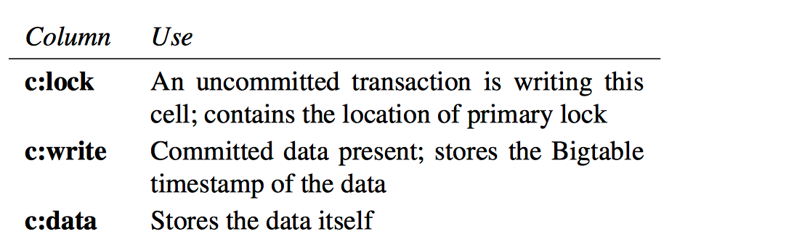

如何查看Bob账户有多少钱？

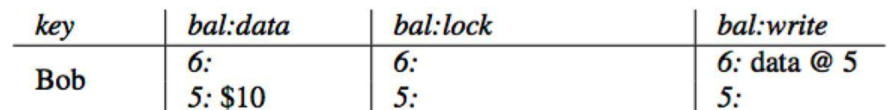

先查询`column write`获取最新时间戳的数据，获取到`data@5`，然后查询`column data`里面时间戳为`5`的数据，即`$10`。

# 流程
一个事务的所有Write在提交之前都会先缓存在Client，然后在提交阶段一次性写入；Percolator 的事务提交是标准的两阶段提交，分为Prewrite和Commit。在每个Transaction开启时会从TSO获取timestamp作为start_ts，在Prewrite成功后Commit前从TSO获取timestamp作为 commit_ts。协议伪代码如下图：

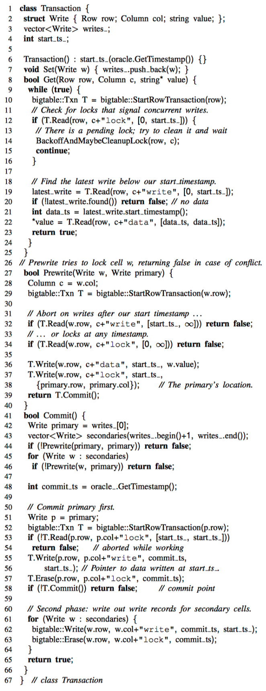

## Set
`Set`只是简单的在内存中做个缓存，实际写入会在`Commit`时触发

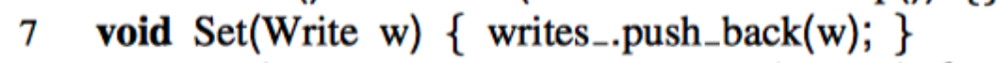

## Get
TODO
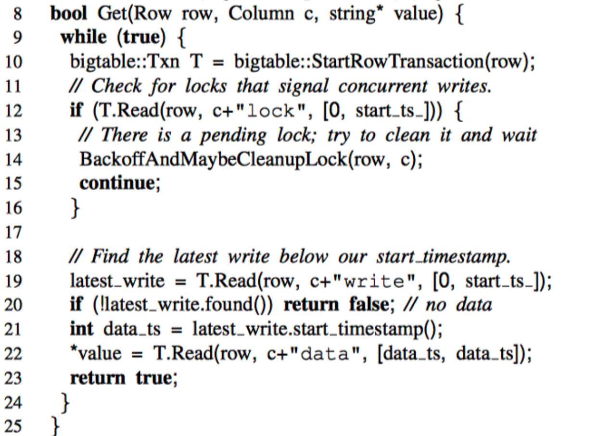

## Prewrite
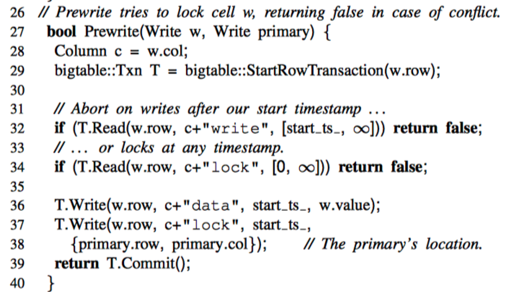

## Commit
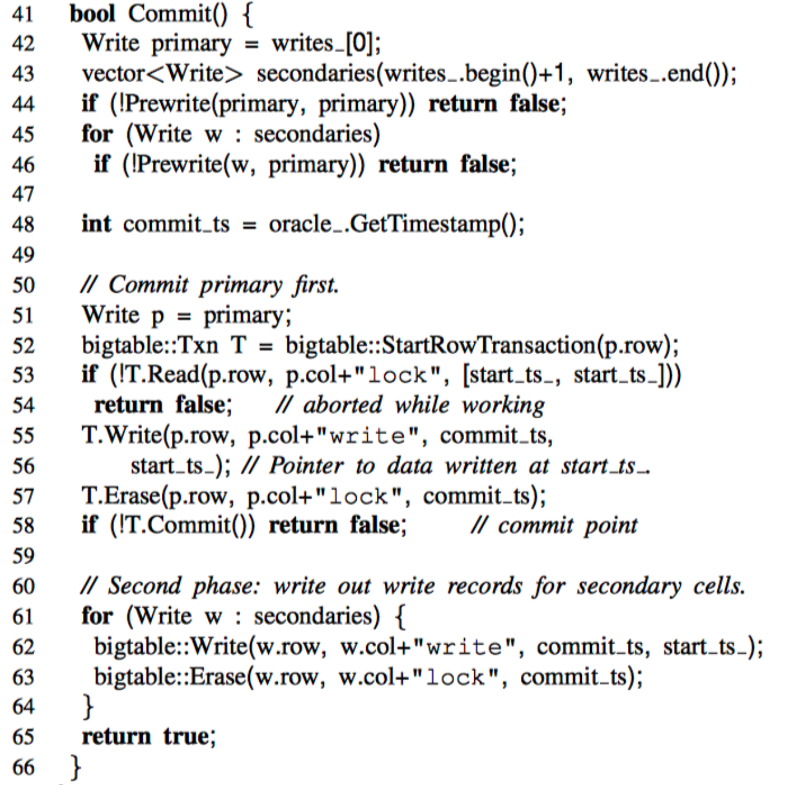

# 案例
下面来看一个银行转账的案例，Bob向Joe转账7美元。

## 初始状态
初始状态下Bob有10美元，Joe有2美元。

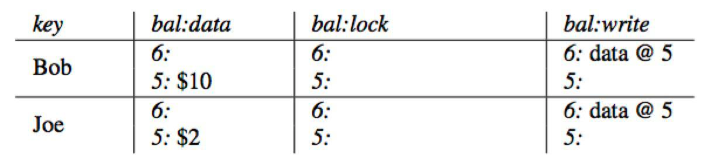

## Prewrite Primary
开始prewrte阶段，首先获取下一个时间戳`timestamp=7`作为事务开始的时间戳，将Bob作为事务的`Primary`，写入`column lock = Primary Lock`和`column data = 3`

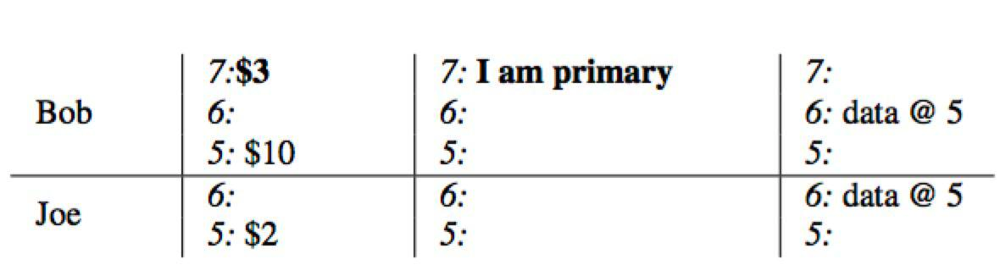

## Prewrite Secondary
同样使用上一步获取的时间戳`timestamp=7`，将Joe的数据写入到`column data = 9`，同时将`column lock`指向上一步的`Primary Lock`

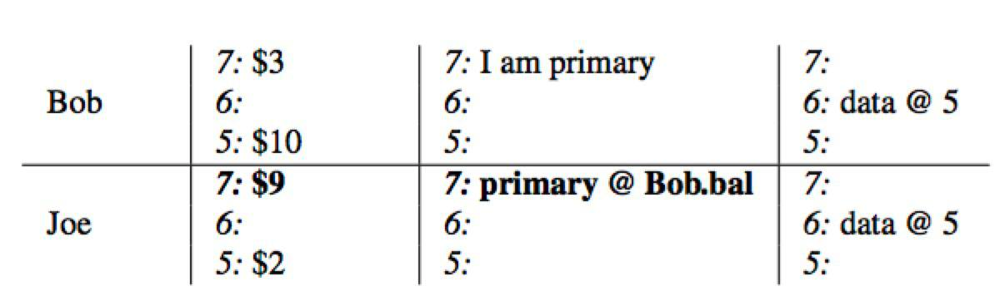

## Commit Primary
开始commit阶段，获取下一个时间戳`timestamp=8`开始commit阶段，删除primary所在的lock，并将`column write`写入提交时间戳指向的数据存储`data@7`

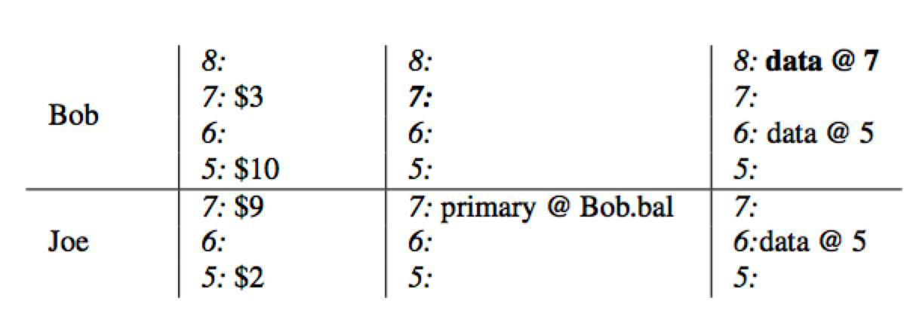

## Commit Secondary
依次在`secondary`中写入`column write`并删除lock

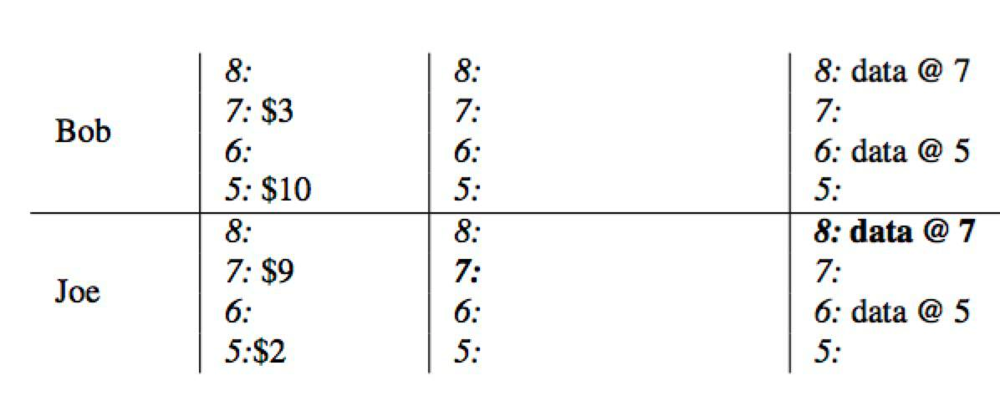

# 参考
- [Large-scale Incremental Processing Using Distributed Transactions and Notifications](https://storage.googleapis.com/pub-tools-public-publication-data/pdf/36726.pdf)
- [Percolator 和 TiDB 事务算法](https://pingcap.com/blog-cn/percolator-and-txn/)
- [Google Percolator 的事务模型](http://andremouche.github.io/transaction/percolator.html)
- [Transaction in TiDB](http://andremouche.github.io/tidb/transaction_in_tidb.html)
- [Google Percolator 分布式事务实现原理解读](http://mysql.taobao.org/monthly/2018/11/02/)
