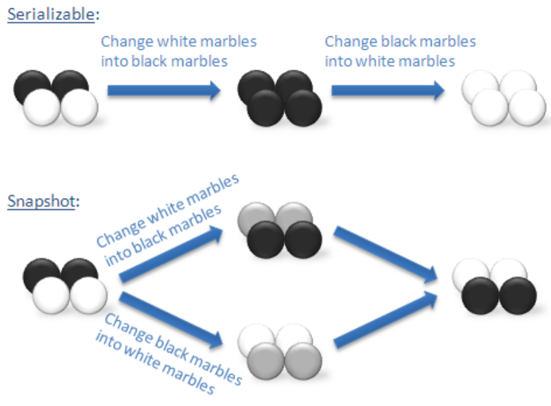

# 事务
一个数据库事务通常包含对数据库进行读或写的一个操作序列。它的存在包含有以下两个目的：
1. 为数据库操作提供了一个从失败中恢复到正常状态的方法，同时提供了数据库即使在异常状态下仍能保持一致性的方法。
2. 当多个应用程序在并发访问数据库时，可以在这些应用程序之间提供一个隔离方法，以防止彼此的操作互相干扰。

数据库事务Transaction有四大特点：ACID
- Atomicity 原子性
- Consistency 一致性
- Isolation 隔离性
- Durability 持久性

以下是一个简单的使用事务的例子：
```
mysql> CREATE TABLE test( id int(5));  # 创建数据表
Query OK, 0 rows affected (0.04 sec)

mysql> select * from test;
Empty set (0.01 sec)

mysql> begin;  # 开始事务
Query OK, 0 rows affected (0.00 sec)

mysql> insert into test value(5);
Query OK, 1 rows affected (0.01 sec)

mysql> insert into test value(6);
Query OK, 1 rows affected (0.00 sec)

mysql> commit; # 提交事务
Query OK, 0 rows affected (0.01 sec)
```

# Isolation 隔离性
本文主要介绍一下Isolation隔离性。

数据库是一个并发系统，可以同时处理不同客户端的请求，如何解决不同客户端之间的读写冲突和写写冲突？
一种简单的做法就是让所有操作都串行化执行，这样可以100%保证数据正确性，但是吞吐量会急剧下降。

大部分业务场景不需要100%保证正确性，但是需要比较高的吞吐量。
隔离性提供了一种在正确性和吞吐量之间的权衡方法，
使用不同的隔离级别可以使数据库使用者在正确性和吞吐量之间做权衡，
- 隔离级别越高，正确性保证越高，但是吞吐量约低
- 隔离级别越低，正确性保证越低，但是吞吐量越高

# ANSI/ISO SQL-92的定义
ANSI/ISO SQL-92中定义了四种隔离级别：
1. READ UNCOMMITTED
2. READ COMMITTED
3. REPEATABLE READ
4. SERIALIZABLE

同时定义了三种异常现象：
1. Dirty Read 脏读
2. Non-repeatable Read 不可重复读
3. Phantom 幻读

## Dirty Read 脏读
事务T1修改了一个数据，事务T2在T1 COMMIT或ROLLBACK前读取了该数据，
如果T1最终执行ROLLBACK，T2将会读到一个不存在的数据。

## Non-repeatable Read 不可重复读
事务T1读取了一个数据，事务T2删除或者修改了这个数据并且COMMIT，如果T1再次读取这个数据，
将会读不到该数据或者读到一个修改过的数据。

## Phantom 幻读
事务T1读取了一些满足某个条件的数据，事务T2插入了满足这个条件的一些数据并且COMMIT，
如果T1再次读取满足这个条件的数据，将会读到和第一次不一样的数据。

## Isolation Level定义
ANSI/ISO SQL-92通过`是否满足以上三个条件`来定义这四个隔离级别，如下表：

| Isolation Level  | Dirty Read   | Non-repeatable Read | Phantom      |
| ---------------- | ------------ | ------------------- | ------------ |
| READ UNCOMMITTED | Possible     | Possible            | Possible     |
| READ COMMITTED   | Not Possible | Possible            | Possible     |
| REPEATABLE READ  | Not Possible | Not Possible        | Possible     |
| SERIALIZABLE     | Not Possible | Not Possible        | Not Possible |

# 基于锁的实现
以上只是ANSI对隔离级别的定义，具体实现和定义还是有很大差别的，先来看一下大部分数据都会使用的一种实现隔离级别的方法：锁。

锁主要分为：
- 读锁
- 写锁

锁作用的对象可以是：
1. 某条数据
2. 某个数据集合

读读可以并发，读写、写写需要互斥访问。

为了解决幻读的问题，需要一种特殊的锁：`Predicate Lock`，
可以对某个`<search condition>`进行加锁，里面的数据有可能是无限多的。

对于某个事物T来说，可以知道所有需要获取的锁，使用`two-phase locking`算法进行加锁和数据读写操作。

加锁的时间分为两种：
1. long duration lock: 直到事务结束才会释放的锁
2. short duration lock: 某些操作结束后立马会释放的锁

# 基于MVCC的实现
MVCC是指Multiversion Concurrency Control，MVCC提供了Snapshot Isolation的隔离级别，保证事务的读操作将看到一个一致的数据库的版本快照（实际上读取比该事务早的最后一次提交值）。该事务的写操作成功提交，仅当基于该快照的任何并发修改与该事务的修改没有冲突（即写-写冲突）。、

但是Snapshot Isolation带来一个大问题：`write skew`，即写偏序问题(不能够达到串行化的事务隔离级别)。

> In a write skew anomaly, two transactions (T1 and T2) concurrently read an overlapping data set (e.g. values V1 and V2), concurrently make disjoint updates (e.g. T1 updates V1, T2 updates V2), and finally concurrently commit, neither having seen the update performed by the other. Were the system serializable, such an anomaly would be impossible, as either T1 or T2 would have to occur “first”, and be visible to the other. In contrast, snapshot isolation permits write skew anomalies.

通俗理解：写偏序（Write Skew）是一致性约束下的异常现象，即两个并行事务都基于自己读到的数据集去覆盖另一部分数据集，在串行化情况下两个事务无论何种先后顺序，最终将达到一致状态，但SI隔离级别下无法实现。下图的“黑白球”常常被用来说明写偏序问题：



# TiDB的事务隔离级别
TiDB 实现了其中的两种：读已提交和可重复读。

## 可重复读
可重复读是 TiDB 的默认隔离级别，当事务隔离级别为可重复读时，只能读到该事务启动时已经提交的其他事务修改的数据，未提交的数据或在事务启动后其他事务提交的数据是不可见的。对于本事务而言，事务语句可以看到之前的语句做出的修改。

尽管名称是可重复读隔离级别，但是 TiDB 中可重复读隔离级别和 ANSI 可重复隔离级别是不同的，TiDB 实现的是论文中的 snapshot 隔离级别，该隔离级别不会出现幻读，但是会出现写偏斜，而 ANSI 可重复读隔离级别不会出现写偏斜，会出现幻读。

## 读已提交
读已提交隔离级别和可重复读隔离级别不同，它仅仅保证不能读到未提交事务的数据，需要注意的是，事务提交是一个动态的过程，因此读已提交隔离级别可能读到某个事务部分提交的数据。

不推荐在有严格一致要求的数据库中使用读已提交隔离级别。

# 参考
- [A Critique of ANSI SQL Isolation Levels](https://www.microsoft.com/en-us/research/wp-content/uploads/2016/02/tr-95-51.pdf)
- [MVCC事务机制：Snapshot Isolation](http://www.nosqlnotes.com/technotes/mvcc-snapshot-isolation/)
- [TiDB 事务隔离级别](https://www.bookstack.cn/read/pingcap-docs-cn/sql-transaction-isolation.md)
