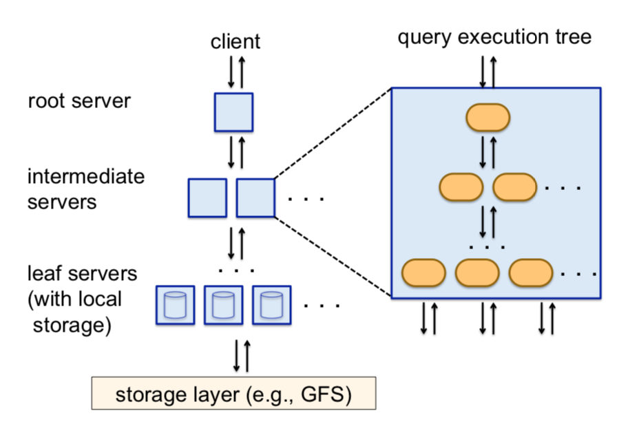

最近阅读了Melnik在2010年发表的论文 《Dremel: Interactive Analysis of Web-Scale Datasets》，这篇论文介绍了Google的一个基础数据分析系统。

这篇文章是我对论文的理解，仅供参考，想了解的建议看论文原文。

# Dremel是什么？

>Dremel is Google’s internal data analysis and exploration system. It is designed for interactive (i.e. fast) analysis of read-only nested data. Its design builds on ideas from parallel database management systems as well as web search.

Dremel是一个用于分析只读嵌套数据的可伸缩、交互式ad-hoc查询系统。通过结合多层级树状执行过程和列状数据结构，它能做到几秒内完成万亿行数据之上的聚合查询。此系统可伸缩至成千上万的CPU和PB级别的数据，而且在google已有几千用户。

这篇文章的主要贡献：
1. 使用列式结构来存储嵌套数据
2. 使用SQL来查询嵌套数据
3. 使用多层级树状执行过程来执行数据库查询

# 为什么开发Dremel?
Google需要处理的网页数据通常是非结构化数据，也就是说很难用传统的MySQL数据库来存储，典型的非结构化数据包括：
- 分布式系统之间传递的消息（Protocol Buffer、Thrift)
- 文档数据，例如网页
- 程序开发中用到的数据结构

注意到上面举得非结构化的数据都是嵌套结构的数据。Dremel就是为了解决大规模非结构化数据存储，以及查询而诞生的，主要特点包括：
- 以原始的方式存储嵌套机构数据
- 读取的时候不需要重新构造原始数据
- SQL可以直接在嵌套数据上进行查询

并且可以在PB级别的数据上进行交互式查询，这就是Dremel想要做的。

# Dremel在Google
早在2006年Dremel就在Google的生产环境上运行了，主要应用包括：
- 爬虫网页文档分析
- 垃圾邮件分析
- 构建系统结果分析
- 崩溃日志分析

Apache Drill是Dremel的开源版本。

# 技术细节
接下来的章节主要来介绍一下Dremel论文的技术细节。

## Data Model
Dremel最重要的是它的数据模型，即嵌套结构数据。例如：


这是Protocol Buffers格式描述的一个嵌套结构数据，其中：
- required 表示一定要存在
- optional 表示可以不存在
- repeated 表示可以存在0-n个

## Storage Model
给定一个Data Model，接下来需要决定如何存储这个Data Model。

由于Dremel的目标是OLAP，而（相比行式存储）列式存储已经被证明比较适合OLAP，因此Dremel也选择使用列式存储格式来存储嵌套数据结构。


那么接下来的问题就是，如何在列式存储里面把嵌套结构信息保存下来呢？Dremel使用的方法是额外存储两个信息：
- Repetition Level 重复深度
- Definition Level 定义深度

有了这两个信息，就可以无损的恢复出原始的嵌套结构。


### Repetition Level 重复深度

> The repetition level tells us at what repeated field in a field’s path the value has repeated.

Repetition Level表示该值在哪层的父亲节点上进行了重复。例如：

```
Name:
    Language:
        Code: 'en'
    Language:
        Code: 'en-us'
Name:
    Language:
        Code: 'en-gb'
```

Repetition Level的值分别为：

```
'en'    | 0
'en-us' | 2
'en-gb' | 1
```

- 'en'是第一个出现的，可以理解为第一次出现在root节点，所以repetition level=0
- 'en-us'重复出现在`Name.Language`上，因此repetition level=2
- 'en-gb'重复出现在`Name`上，因此repetiton level=1

### Definition Level 定义深度

> Definition level indicates how may fields in a path that could be omitted, are actually present.

Definition Level表示该节点到root节点的路径上，有多少个可以不存在的节点实际存在。来看个例子：

```
Name:
    Language:
        Code: 'en-us'
        Country: 'USA'
    Language:
        Code: 'fr'
Name:
    Language:
        Code: 'en-gb'
        Country: 'USA'
```

在`Name.Language.Code`字段中，`Name`和`Name.Language`是repeated，也就是说是可以不存在的，如果`Name`实际存在，那么definition level就增加1，如果`Name.Language`也存在，那么definition level再增加1，变成2。


## Query Language

Dremel提供了一套SQL语言来进行对数据的查询，先来看一个例子：

```
SELECT DocId AS Id,
  COUNT(Name.Language.Code) WITHIN Name AS Cnt,
  Name.Url + ',' + Name.Language.Code AS Str
FROM t
WHERE REGEXP(Name.Url, '^http') AND DocId < 20;
```

这个SQL语句的结果如下：

```
DocId: 10
Name:
    Cnt: 2
    Language:
        Str: 'http://A,en-us'
        Str: 'http://A,en'
Name:
    Cnt: 0
```

## Query Execution

Dremel的执行引擎由执行树组成，
1. 客户端把请求交给root server
2. root server负责语法解析，然后读取table的meta data（包括数据有多少分区，分别在什么地方等）
3. root server接着会重写sql语句，并交给多个intermediate server
4. intermediate server会继续重写sql语句，并递归地交给其他intermediate server
5. intermediate server最后会生成叶子节点，交给leaf servers，由leaf servers负责读取数据



下面来看下如何重写sql语句？所谓的重写sql语句，其实就是一个分而治之的算法，举个例子：

对于这个SQL查询
```
SELECT COUNT(A) FROM T
```

可以利用分而治之的思想重写成
```
SELECT SUM(C) FROM (R_1 UNION ALL ... R_n)
```

其中`R_i`是
```
SELECT COUNT(A) AS C FROM T_i
```

这样就把一个大的任务，分成了n个小任务，每一个小任务对于到一个分区（分布式存储上的一个文件）。

# 总结

个人觉得Dremel的主要贡献点有2个：
1. 发明了一种使用列式方式存储嵌套数据的格式，列式对查询比较友好，嵌套对数据表达比较友好，兼顾了用户体验和查询速度。
2. 利用分而治之算法把大查询进行切割，并分布式执行，虽然Dremel论文里面提到还不支持join，但这个思路是后续MPP引擎（Impala、Presto等）的基础。

# 参考
- [Dremel: Interactive Analysis of Web-Scale Datasets](https://www.comp.nus.edu.sg/~vldb2010/proceedings/files/papers/R29.pdf)
- [A Look at Dremel](http://www.goldsborough.me/distributed-systems/2019/05/18/21-09-00-a_look_at_dremel/)
