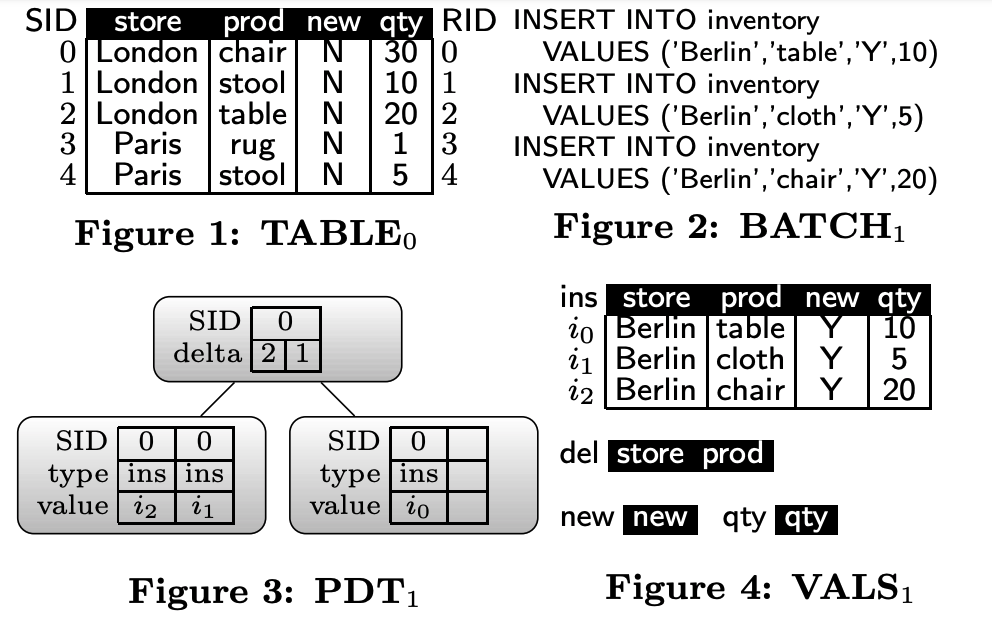
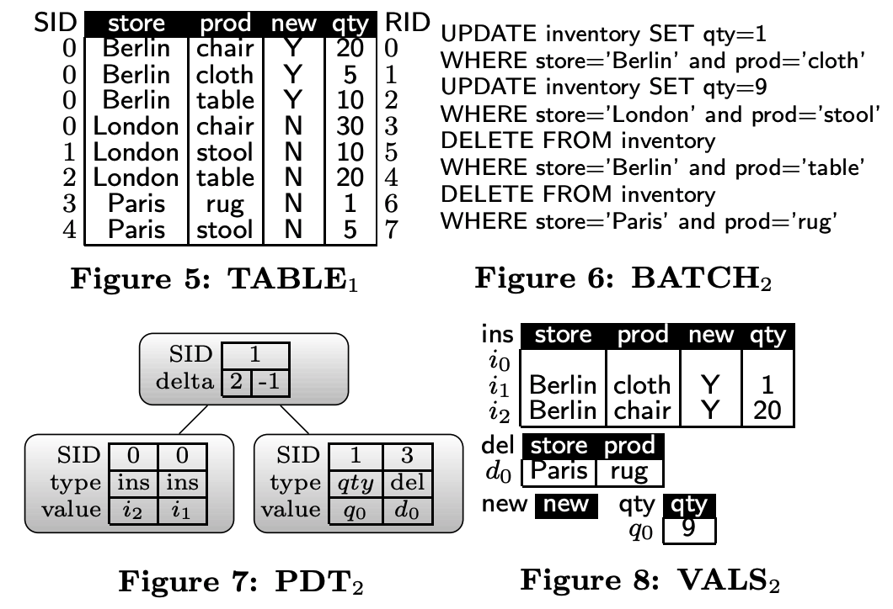
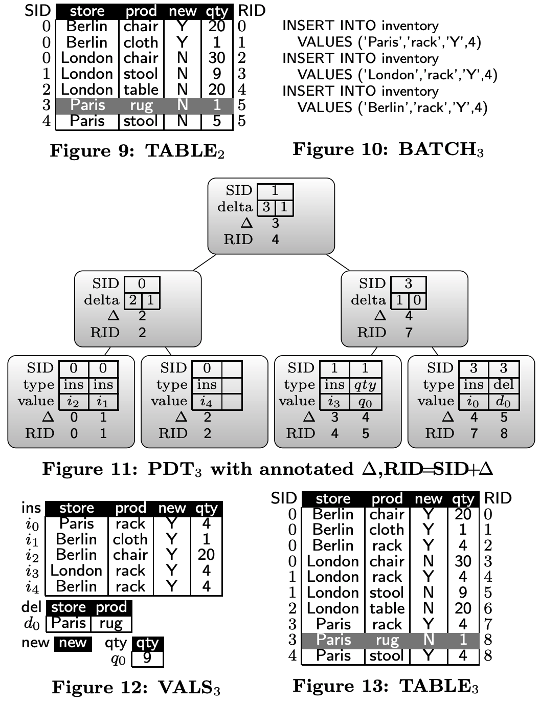
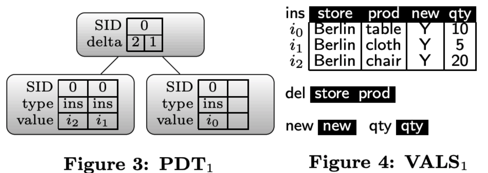
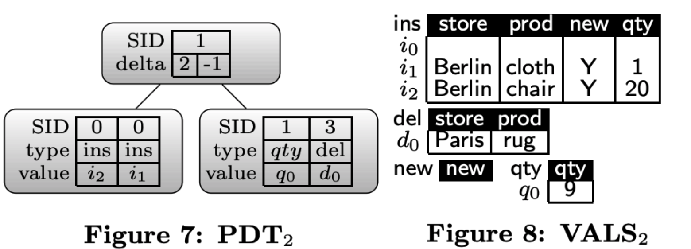
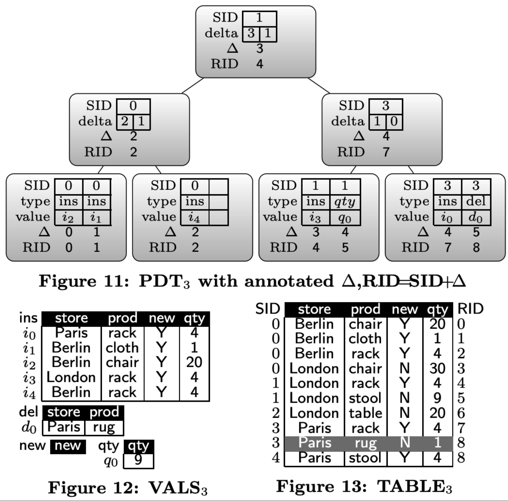

# PDT by Example






## 初始化

**TABLE0**

| store  | prod  | new | qty | SID | RID |
| ------ | ----- | --- | --- | --- | --- |
| London | chair | N   | 30  | 0   | 0   |
| London | stool | N   | 10  | 1   | 1   |
| London | table | N   | 20  | 2   | 2   |
| Pairs  | rug   | N   | 1   | 3   | 3   |
| Pairs  | stool | N   | 5   | 4   | 4   |


## 运行BATH1 (INSERT)

```
INSERT INTO inventory VALUES('Berlin', 'table', 'Y', 10)

INSERT INTO inventory VALUES('Berlin', 'cloth', 'Y', 5)

INSERT INTO inventory VALUES('Berlin', 'chair', 'Y', 20)
```

**PDT1**



逻辑上`TABLE0` + `PDT1`就等价于`TABLE1`

**TABLE1**

| store  | prod  | new | qty | SID | RID |
| ------ | ----- | --- | --- | --- | --- |
| Berlin | chair | Y   | 20  | 0   | 0   |
| Berlin | cloth | Y   | 5   | 0   | 1   |
| Berlin | table | Y   | 10  | 0   | 2   |
| London | chair | N   | 30  | 0   | 3   |
| London | stool | N   | 10  | 1   | 4   |
| London | table | N   | 20  | 2   | 5   |
| Pairs  | rug   | N   | 1   | 3   | 6   |
| Pairs  | stool | N   | 5   | 4   | 7   |

## 运行BATCH2 (UPDATE和DELETE)
```
UPDATE inventory SET qty=1 WHERE store='Berlin' and prod='cloth'

UPDATE inventory SET qty=9 WHERE store='London' and prod='stool'

DELETE FROM inventory WHERE store='Berlin' and prod='table'

DELETE FROM inventory WHERE store='Paris' and prod='rug'
```



`UPDATE inventory SET qty=1 WHERE store='Berlin' and prod='cloth'`，这句update的数据在`PDT1`中（`ins=i1`)，因此直接修改`VALS1`中的数据。

`UPDATE inventory SET qty=9 WHERE store='London' and prod='stool'`，这句update的数据在`TABLE0`中（`SID=1`、`RID=1`），因此在`PDT2`中创建一个节点（`SID=1`、`type=qty`、`value=q0`、`q0=9`）。

`DELETE FROM inventory WHERE store='Berlin' and prod='table'`，这句delete的数据在`PDT1`中(`ins=i0`)，因此直接删除`i0`的数据。

`DELETE FROM inventory WHERE store='Paris' and prod='rug'`，这句delete的数据在`TABLE0`中(`SID=3`、`RID=3`)，因此在`PDT2`中创建一个节点(`SID=3`、`type=del`、`value=d0`、`d0={store: Paris, prod: rug}`)。

逻辑上`TABLE1` + `PDT2`就等价于`TABLE2`

**TABLE2**

| store     | prod    | new   | qty   | SID   | RID   |
| --------- | ------- | ----- | ----- | ----- | ----- |
| Berlin    | chair   | Y     | 20    | 0     | 0     |
| Berlin    | cloth   | Y     | 1     | 0     | 1     |
| London    | chair   | N     | 30    | 0     | 2     |
| London    | stool   | N     | 9     | 1     | 3     |
| London    | table   | N     | 20    | 2     | 4     |
| **Pairs** | **rug** | **N** | **1** | **3** | **5** |
| Pairs     | stool   | N     | 5     | 4     | 5     |

## 运行BATCH3 (INSERT)

```
INSERT INTO inventory VALUES ('Paris', 'rack', 'Y', 4)

INSERT INTO inventory VALUES ('London', 'rack', 'Y', 4)

INSERT INTO inventory VALUES ('Berlin', 'rack', 'Y', 4)
```



`delta`: 表示该节点左侧`ins操作数量`-`del操作数据量`

`RID` = `SID` + `delta`


# 参考
- [Positional Update Handling in Column Stores](https://event.cwi.nl/SIGMOD-RWE/2010/22-7f15a1/paper.pdf)
