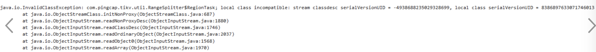
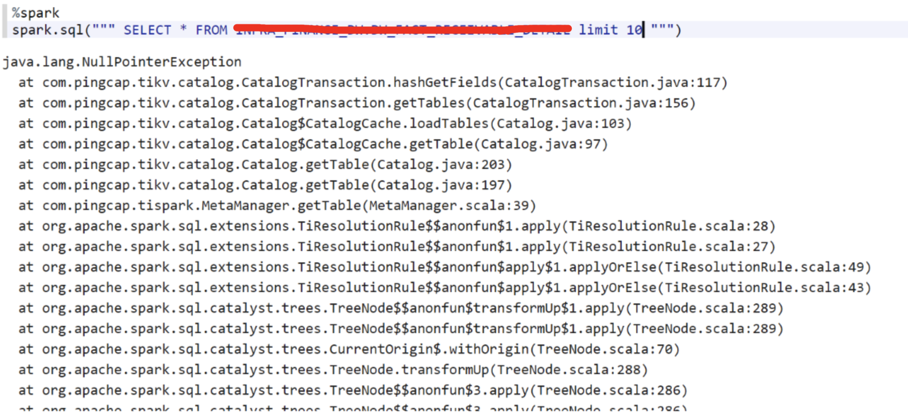
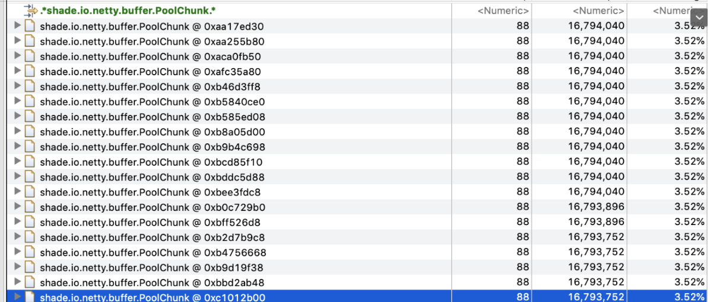
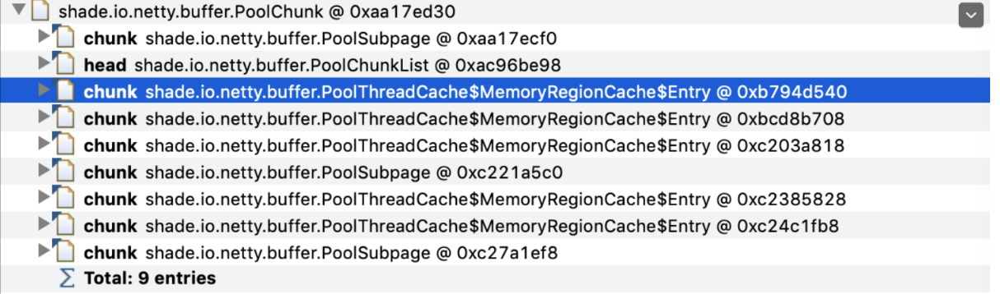

最近处理了好几个客户报的bug，搞得我焦头烂额，乘此机会梳理一下。

之前在爱奇艺上班，也经常处理客户Trouble Shooting的事情，但是之前所谓的客户都是公司内部的同事，需要排查的程序也都部署在公司内部的服务器上，而我们有服务器的root权限，因此Trouble Shooting起来非常方便，首先复现问题非常容易，因为客户出bug的环境就是我们自己的环境，其次各种linux、jvm的调试工具都可以使用。

来到PingCAP之后，现在的客户都是外面公司的开发人员，程序都部署在对方公司的机房，条件好的可以给我们开一个远程界面，可以远程操作，条件不好的连一个Error Stack也不能拷贝出来，只能拍个照片发给我们，哭~~，本文主要分享一下我在PingCAP的一些Trouble Shooting的案例。

# 案例一
有天某个客户跟我说

```
用tispark无法读取tidb的表，但是能正常读取hive的表
```

于是开始了我一下午的Trouble Shooting之旅，先要到了客户远程的控制权限
1. 先确定版本 => 没问题
2. 看配置是否正确 => 没问题
3. 看日志 => 没有异常
4. ...

发现都没有问题，但是就是无法读取数据，最后无意中发现tispark的jar包linux权限设置不对，导致提交spark任务的user没有权限读取。

原来客户是手动拷贝tispark的jar包到安装目录，但是拷贝用的linux user不对。

# 案例二
又有一天某个客户跟我说

```
升级集群以后，发现下面的错误
local class incompatible
```




根据以往的经验，这个错一般是由于在分布式集群上使用2个不同版本的jar包，在序列化和反序列化的时候会检测到前后的类不一样，而抛的错。再加上用户说是集群升级以后报的错，基本可以确定用户在升级的时候没有替换所有的jar包，或者某些进程没有重启。

让客户自己排查一下，果然跟我说

```
有个客户端（Azkaban）没有重启
```

# 案例三
又有一天某个客户跟我说

```
select某张特定的表，抛下面的异常，其他表都能正常访问
```



看这个Error Stack怎么有点眼熟，貌似是之前修过的一个bug，询问了一下客户使用的版本，果然是比较老的版本，让客户升级到最新版，问题就解决了。

# 案例四
又有一天某个客户跟我说

```
用TiSpark从TiDB导数据到Hive的时候，报了如下的错
Caused by: shade.io.netty.handler.codec.DecoderException:
shade.io.netty.util.internal.OutOfDirectMemoryError
```
经调查发现是tispark和tikv通讯的时候，使用了GRPC，而GRPC底层是使用netty进行通讯的，这个错误表明上看是由于netty在通讯的时候需要申请native memory，错误是由于native memory不够导致的。

让客户把内存从1G调大到8G后，原先无法跑过的任务可以顺利跑过。

过了几天客户又跟我说

```
虽然一次导30天的数据没问题，但是一次跑600天的数据，还是会报Netty OOM的错。
```

我们初步怀疑问题的本质原因是netty有内存泄漏，先尝试在本地复现，以失败告终，只能到客户现场把heap dump出来，回来分析。

发现19个shade.io.netty.buffer.PoolChunk对象，每个16M，总共占了304M左右内存。



发现shade.io.netty.buffer.PoolChunk对象被shade.io.netty.buffer.PoolThreadCache引用，因此怀疑是Netty的PoolThreadCache机制导致的内存无法释放。



为了验证这个猜想，我们让客户加上了这个参数-Dshade.io.netty.allocator.type=unpooled，也就是说让Netty禁止使用Memory Pool，发现客户的程序可以正常运行。
