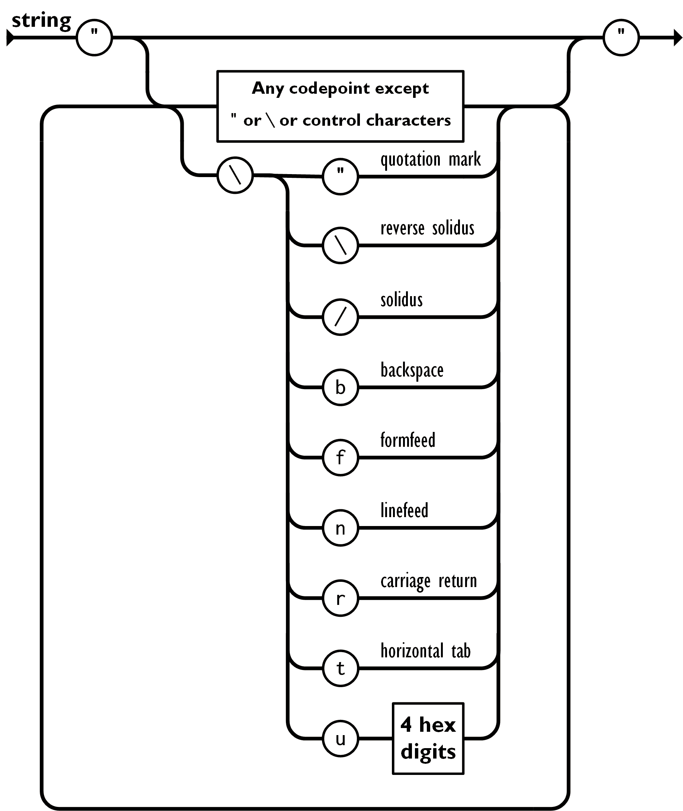

最近在处理一个客户bug的时候，发现一个关于编码的有意思的事情，来跟大家聊聊。

# 发现问题

经过一下试验发现TiSpark读取`BIT`类型列的Default Value的时候，报下面这个错

```
spark-sql> select * from t_origin_default_value_2;                                                                      
ERROR SparkSQLDriver: Failed in [select * from t_origin_default_value_2]                              
java.lang.NumberFormatException: For input string: "�"                                                                  
        at java.lang.NumberFormatException.forInputString(NumberFormatException.java:65)                                
        at java.lang.Long.parseLong(Long.java:589)                                                                      
        at java.lang.Long.parseLong(Long.java:631)                                                                      
        at com.pingcap.tikv.types.IntegerType.getOriginDefaultValueNonNull(IntegerType.java:157)                        
        at com.pingcap.tikv.types.DataType.getOriginDefaultValue(DataType.java:327)                                     
        at com.pingcap.tikv.meta.TiColumnInfo.getOriginDefaultValueAsByteString(TiColumnInfo.java:192)                  
        at com.pingcap.tikv.meta.TiColumnInfo.toProtoBuilder(TiColumnInfo.java:315)                                     
        at com.pingcap.tikv.meta.TiColumnInfo.toProto(TiColumnInfo.java:304)                                            
        at com.pingcap.tikv.meta.TiDAGRequest.buildScan(TiDAGRequest.java:427)                                          
        at com.pingcap.tikv.meta.TiDAGRequest.buildTableScan(TiDAGRequest.java:276)                                     
        at com.pingcap.tikv.meta.TiDAGRequest.init(TiDAGRequest.java:969)                                               
        at com.pingcap.tikv.meta.TiDAGRequest.init(TiDAGRequest.java:974)                                               
        at com.pingcap.tikv.meta.TiDAGRequest.toString(TiDAGRequest.java:997)                                           
        at java.lang.String.valueOf(String.java:2994)      
        at java.lang.StringBuilder.append(StringBuilder.java:131)
```

TiDB是用JSON格式来存储Table的Schema信息，包括每一列是什么类型，默认值是多少，是否可以是Null等信息。

这个错误大概的意思是说，TiSpark在解析这个JSON的时候抛错，也就是说这是一个非法的JSON字符串。

# 做实验
发现这个现象后，我做了几个试验

```
# 创建BIT列默认值为0的表
CREATE TABLE `test_0` (
  `id` bigint(20) NOT NULL,
  `b` bit(1) NOT NULL DEFAULT b'0'
);

# 创建BIT列默认值为1的表
CREATE TABLE `test_1` (
  `id` bigint(20) NOT NULL,
  `b` bit(1) NOT NULL DEFAULT b'1'
);

# 创建BIT列默认值为01010101的表
CREATE TABLE `test_2` (
  `id` bigint(20) NOT NULL,
  `b` bit(8) NOT NULL DEFAULT b'01010101'
);

# 分别在3张表插入一条数据
insert into test_0(id) values(1);
insert into test_1(id) values(1);
insert into test_2(id) values(1);
```

然后分别把3张表的Schema的JSON字符串打印出来，发现有3个字段和Default Value有关，分别是：
1. default
2. default_bit

BIT列默认值为0的表的Schema JSON


BIT列默认值为0的表的Schema JSON


BIT列默认值为01010101的表的Schema JSON


总结一下规律，发现`default`字段用的是ASSIC编码，如下图所示

| 二进制   | default (ASSIC)   | default_bit |
| -------- | ----------------- | ----------- |
| 0        | NUL               | AA==        |
| 1        | start of headline | AQ==        |
| 01010101 | U                 | VQ==        |

# 发现问题
既然有了`default`字段来表示，那为啥还需要default_bit字段呢？

查了下JSON中字符串的定义，发现并不是所有的字符串都是符合JSON规范的，如下图所示



在JOSN字符串中如果出现了`control characters` 或者 `"` 或者 `\` 是需要转义的，也就是说需要在这些字符前面加上一个额外的`\`，否则就是非法的JSON字符串，例如下面几个就是非法的JSON字符串：
- `a"a`
- `a\a`

正确的表示应该是：
- `a\"a`
- `a\\a`

也就是说如果用ASSIC来编码BIT类型的数据，存储到JSON里面是会产生非法的JSON字符串的，本文开头的错误日志，就是这个原因导致。

后来问了下TiDB的同学，果然如此，TIDB使用ASSIC编码存储到`default`字段，对于一般的数据类型例如`INT`、`VARCHAR`都没什么问题，但是对于BIT类型来说，会产生非法的JSON字符串，为了修复这个bug，后来又增加了`default_bit`字段来存储`BIT`类型的默认值。

# AA== AQ==是啥编码？
那边问题来了`default_bit`用的是什么编码方式呢？该编码应该符合以下条件：
1. 需要编码出JSON合法的字符串
2. 编码后长度尽量短

满足第一条的有很多候选，例如：
1. 把二进制变成0101的字符串
2. 用16进制表示

第一种显然编码后长度非常长，第二种的话虽然长度变短了，但是不符合试验的情况（试验中会出现`=`，而16进制里面没有`=`)。

仔细一想，16进制可以的话，用64进制也应该可以，选64个符合JSON规范的ASSIC码里面的字符就可以了，搜索了一下，果然有这种编码，还有一个名字叫`Base64`。

而试验中得到的编码`AA==`、`AQ==`和`VQ==`果然都符合BASE64的编码规范，解析出来就是`0`、`1`和`01010101`

| 二进制   | default_bit (BASE64) |
| -------- | -------------------- |
| 0        | AA==                 |
| 1        | AQ==                 |
| 01010101 | VQ==                 |

# PR
最后问题解决，提了PR
https://github.com/pingcap/tispark/pull/1148
