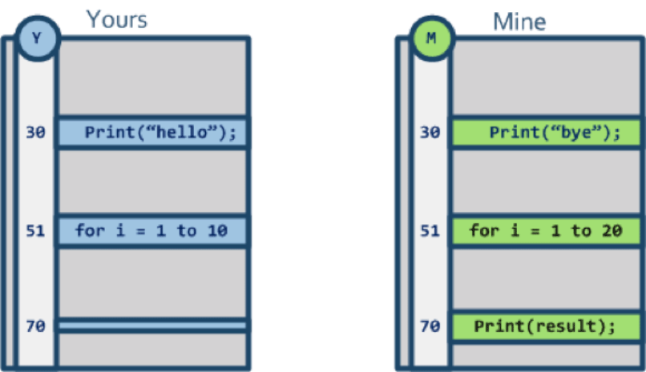
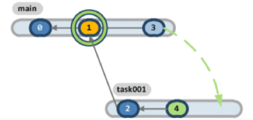
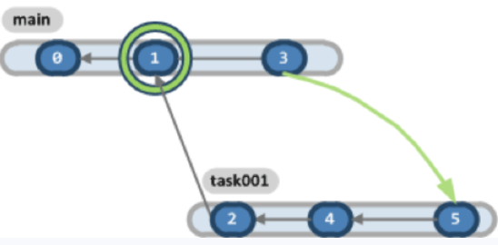
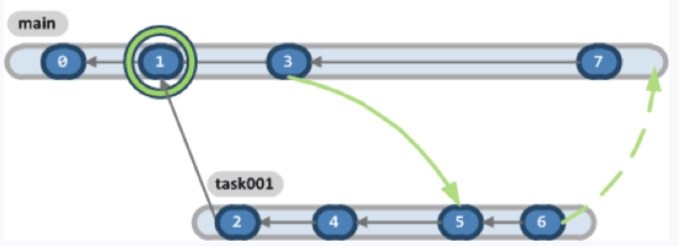
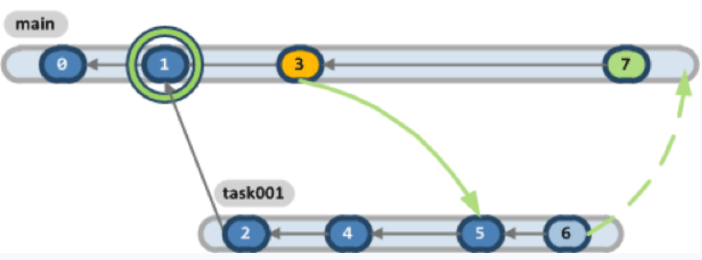
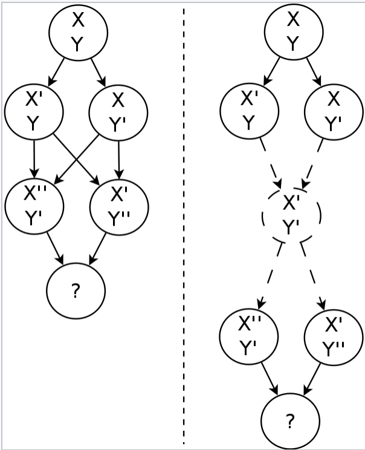

最近工作上需要用到git cherry-pick来生成一个特殊的软件版本，具体要求如下
- 基于v3.0.1的稳定版本
- 加入2个只在master branch的Patch: F1和F2
- 能编译并通过ci测试

commit和branch如下图：
```
G <-- master
|
F2
|
E
|     F2  <-- my-goal
F1   /
|   F1
D  /
| C <-- v3.0.1
|/
B
|
A
```

具体的做法是：
1. `git checkout -b my-goal v3.0.1`
2. `git cherry-pick F1`
3. `git cherry-pick F2`

其中遇到很多问题，例如：
1. `cherry-pick F1`后无法编译，因为`F1`依赖`D`中的一些变更
2. 通过git命令进行`cherry-pick F2`出现大量冲突，后来通过人工肉眼进行对比修改，可以成功`cherry-pick`

对于第1个问题：要么就把`D`也cherry-pick过来，要么手动把`D`的部分必要修改也加过来。

对于第2个问题：既然人可以成功解决冲突，为啥git不能自动帮我解决呢？这就涉及到git的merge算法。

git merge文件是以行为单位进行一行一行进行合并的，但是有些时候并不是两行内容不一样git就会报冲突，因为git会帮我们自动进行取舍，分析出哪个结果才是我们所期望的，如果git都无法进行取舍的时候才会报冲突，这个时候才需要我们进行人工干预。那git是如何帮我们进行merge操作的呢?

# Two Way Merging
在介绍git merge算法前，先来看一个比较简单的算法：`Two Way Merging`。

假设你和另外一个人同时修改了一个文件，这时第三个人看到了这两个文件，如下图：


第三个人发现30行不一样，
- 在`Yours`的版本里内容是：`Print("hello")`
- 在`Mine`的版本里内容是：`Print("bye")`

但是
- TA怎么知道是你修改了30行还是另外一个人修改了？
- 还有一种可能是你们两个都修改了？TA根本不知道

因此Two Way Merging不能解决同时修改同一个文件的冲突，只能发现冲突，需要手动解决。

# Three Way Merging
如果增加一个信息，TA知道你们两修改前公共的`Base`版本(`Yours`和`Mine`修改前的版本)呢？


这时TA发现：
- 修改前的`Base`版本里的内容是：`Print("bye")`
- 在`Yours`的版本里内容是：`Print("hello")`
- 在`Mine`的版本里内容是：`Print("bye")`

这就说明`Yours`对这一行做了修改，而`Mine`对这行没有做修改，因此对`Yours`和`Mine`进行merge后的结果应该采用`Yours`的修改，于是就变成`Print("hello")`，这就是Three Way Merging的大致原理。

# Three Way Merging的一个复杂案例
我们来看一个更加复杂的案例，如下图：



按行对比两个文件后，我们发现有3个地方不一样，分别是：
1. 30行：上文描述的冲突案例
2. 51行：有一个for循环被同时修改
3. 70行：`Mine`的版本里面新增了一行

我们来看一下这三种冲突改怎么解决：
1. 30行：只有`Yours`修改了，因此使用`Yours`的版本
2. 51行：`Yours`和`Mine`都修改了，需要手工解决冲突
3. 70行：`Mine`新增了一行，因此使用`Mine`的版本


# 使用Three Way Merging进行merge
我们来看下git是如何使用Three Way Merging来进行`git merge`操作的。

先来看下`git merge`在官网的定义：

```
git-merge - Join two or more development histories together
```

即把两个或两个以上的开发历史进行合并。

这样讲比较抽象，来看一个简单的例子，假设我们有2个branch：
- main：master branch
- task001：我们正在开发的branch

## 第一次Merge：main -> task
我们在`task001`上开发了一段时间，需要把`main`上的修改合并到`task001`，这时可以运行
```
$ git checkout task001
$ git merge main
```



merge后结果如下



merge的过程其实就是使用Three Way Merging，其中
1. `Base` = `commit 1`
2. `Mine` = `commit 4`
3. `Yours` = `commit 3`

## 第二次Merge：task -> maim
我们继续在`task001`上开发了几个commit后，终于完成了任务，需要把`task001`合并会`main`，这时可以运行

```
$ git checkout main
$ git merge task001
```



这次merge的过程也是一次Three Way Merging，其中：
1. `Base` = `commit 3`
2. `Mine` = `commit 7`
3. `Yours` = `commit 6`



## `git merge`如何选择`Base`
一般情况下`Base`会选择`Yours`和`Mine`节点的`最近的公共祖先`。

但是有的时候`最近的公共祖先`不是唯一的，如下图所示：



这种特定的merge被称作`Criss-cross-merge`，具体步骤如下：
1. 先把候选的两个`最近的公共祖先`递归调用merge，生成成一个虚拟的节点
2. 然后让这个虚拟节点作为`Base`

# 使用Three Way Merging进行cherry-pick
cherry-pick在官网的定义如下：

```
git-cherry-pick - Apply the changes introduced by some existing commits
```

即把已经有的commit apply到其他分支，`git cherry-pick`其实也是使用Three Way Merging，其中：
1. `Mine` = 执行`cherry-pick`时所在的branch的HEAD
2. `Yours` = 被`cherry-pick`的那个commit
3. `Base` = 被`cherry-pick`的那个commit的前一个commit

这样讲比较抽象，举个例子：
```
E <-- master
|
D
| C <-- foo_feature(*)
|/
B
|
A
```

假设我们目前在`foo_feature`分支，运行`git cherry-pick D`，这时Three Way Merging的参数：
- `Mine` = `C`
- `Yours` = `D`
- `Base` = `B`

假设我们目前在`foo_feature`分支，运行`git cherry-pick E`，这时Three Way Merging的参数：
- `Mine` = `C`
- `Yours` = `E`
- `Base` = `D`

# 使用Three Way Merging进行rebase
rebase官方定义如下：
```
git-rebase - Reapply commits on top of another base tip
```

即使用其他分支作为基础，重新apply当前分支所有的commit，`git rebase`的过程可以看做是不断的做`git cherry-pick`，举个例子：

```
E <-- master
|
|   F <-- foo_feature(*)
D  /
| C
|/
B
|
A
```

在`foo_feature branch`运行下面运行`git rebase master`命令，就会变成下面的样子：
```
E <-- master
|
|       F <-- foo_feature(*)
|      /
|     C
D    /
|   E
|  /
| D
|/
B
|
A
```

相当于运行了下面几个命令：
```
git checkout master
git checkout -b foo_feature_rebased
git cherry-pick C
git cherry-pick F
```

# 参考
- [Three-Way Merging: A Look Under the Hood](http://www.drdobbs.com/tools/three-way-merging-a-look-under-the-hood/240164902)
- [Merge_(version_control)](https://en.wikipedia.org/wiki/Merge_(version_control))
- [In a Git cherry-pick or rebase merge conflict, how are BASE (aka “the ancestor”), LOCAL, and REMOTE determined?](https://stackoverflow.com/questions/10058068/in-a-git-cherry-pick-or-rebase-merge-conflict-how-are-base-aka-the-ancestor)
