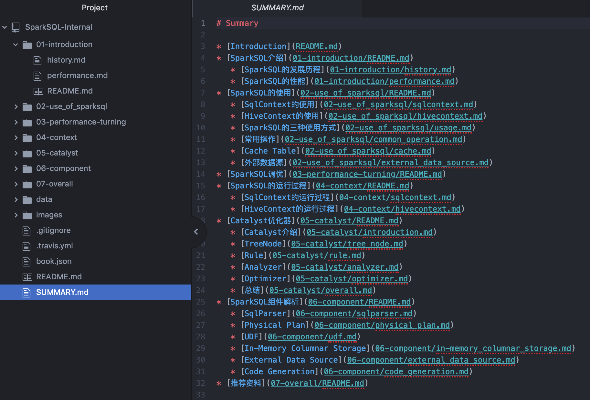
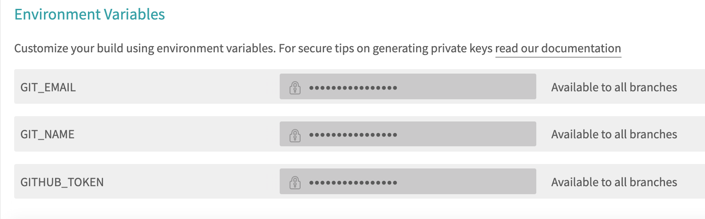
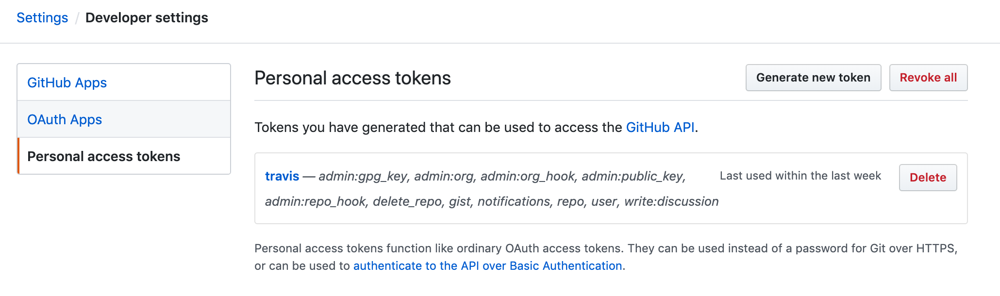

GitBook是一款开源的电子书制作软件，基于Node.js，让你能够使用GitHub/Git和Marsdwon构建出美丽的pdf文档。


# 安装Gitbook

## 1.安装Node.js
Windows请到[这里](http://nodejs.org/download/)下载并安装Node.js

Mac运行
```
$ brew install node
```

## 2. 安装Gitbook
```
$ npm install gitbook-cli -g
```

## 3. 安装Calibre
如果需要导出PDF请到[这里](http://www.calibre-ebook.com/)下载并安装Calibre

需要把`ebook-convert`放到系统路径上
```
$ ln -s /Applications/calibre.app/Contents/MacOS/ebook-convert /usr/local/bin
```

# 编辑电子书
## 1. 初始化
运行
```
$ gitbook init
```
可以在本地初始化一本电子书的目录结构。

其中必备两个文件：
- README.md：为电子书的简介内容
- SUMMARY.md：用来定义电子书章节结构，如：



## 2. 实时本地预览
运行
```
$ gitbook serve
```
可以通过 http://localhost:4000 进行实时预览

## 3. 导出网页
运行
```
$ gitbook build
```
会在`./_book`目录下面生成网页

## 4. 导出PDF
运行
```
$ gitbook pdf
```
会在生成`book.pdf`文件

# 利用Github + Travis自动发布电子书
## 1. 新建github仓库
新建github仓库（e.g. `SparkSQL-Internal`)，并把markdown文件push上来

## 2. 配置.travis.yml
新建文件`.travis.yml`，内容如下：

```
language: node_js

node_js:
  - "8"

# 缓存依赖
cache:
  directories:
    - $HOME/.npm

before_install:
  - export TZ='Asia/Shanghai' # 更改时区

# 依赖安装
install:
  - npm install gitbook-cli -g
  # 安装 gitbook 插件
  - gitbook install

# 构建脚本
script:
    # 自定义输出目录 gitbook build src dest
  - gitbook build . ./build
  # - gitbook build . ./build/$CUSTOM_PATH

# 分支白名单
branches:
  only:
    - master # 只对 master 分支进行构建

# GitHub Pages 部署
deploy:
  provider: pages
  skip_cleanup: true
  # 在项目仪表盘的 Settings -> Environment Variables 中配置
  github_token: $GITHUB_TOKEN
  # 将 build 目录下的内容推送到默认的 gh-pages 分支上，并不会连带 build 目录一起
  local_dir: build
  #fqdn: $CUSTOM_DOMAIN
  name: $GIT_NAME
  email: $GIT_EMAIL
  on:
    branch: master
```

## 3. 配置travis
在[travis网页]（https://travis-ci.org/)上关联github上的项目，然后配置以下三个参数：
1. GIT_EMAIL
2. GIT_NAME = `SparkSQL-Internal`
3. GITHUB_TOKEN



GITHUB_TOKEN需要到[github网页](https://github.com/settings/tokens)生成一个token



## 4. 访问网页
最后可以在[http://marsishandsome.github.io/SparkSQL-Internal/](http://marsishandsome.github.io/SparkSQL-Internal/)访问电子书网页，并且每次修改内容后会自动更新网页。

# 参考
- [GitBook Github地址](https://github.com/GitbookIO/gitbook)
